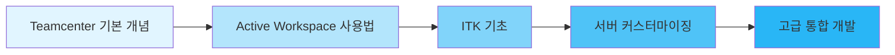

# 🚀 Siemens Teamcenter 학습 저장소

**PLM(Product Lifecycle Management) 솔루션 Teamcenter 개발 및 커스터마이징 학습 공간**

---

## 📚 목차

- [소개](#-소개)
- [주요 리소스](#-주요-리소스)
- [개발자 문서](#-개발자-문서)
- [커뮤니티 및 지원](#-커뮤니티-및-지원)
- [시작하기](#-시작하기)

---

## 🎯 소개

이 저장소는 **Siemens Teamcenter** PLM 솔루션을 학습하고 커스터마이징하기 위한 리소스와 참고 자료를 모아둔 공간입니다.

Teamcenter는 제품 수명 주기 관리를 위한 업계 최고의 솔루션으로, 제품 개발부터 제조, 서비스까지 전 과정을 통합 관리합니다.

---

## 🌐 주요 리소스

### 공식 웹사이트

| 리소스 | 설명 | 링크 |
|--------|------|------|
| 🏠 **Siemens 홈페이지** | Siemens 소프트웨어 공식 한국어 사이트 | [바로가기](https://www.sw.siemens.com/ko-KR/) |
| 📖 **Teamcenter 공식 문서** | 전체 제품 문서 및 가이드 | [바로가기](https://docs.sw.siemens.com/en-US/doc/282219420/PL20230510731367206.tc_doc_home) |
| 📄 **한국어 문서** | 한국어로 제공되는 공식 문서 | [바로가기](https://docs.sw.siemens.com/ko-KR/documents/282219420/PL20230510731367206) |

---

## 💻 개발자 문서

### 서버 커스터마이징

> **Teamcenter Server Customization**  
> ITK(Integration Toolkit)를 활용한 서버 측 커스터마이징 가이드

🔗 [Server Customization 문서](https://docs.sw.siemens.com/ko-KR/doc/282219420/PL20230510731367206.itk/xid2276819)

**주요 내용:**
- ✅ ITK API 사용법
- ✅ 커스텀 비즈니스 로직 구현
- ✅ 서버 확장 및 통합
- ✅ 데이터 모델 커스터마이징

### 클라이언트 개발

> **Active Workspace Fundamentals**  
> 최신 웹 기반 클라이언트 Active Workspace 개발 가이드

🔗 [Active Workspace 문서](https://docs.sw.siemens.com/en-US/doc/282219420/PL20230510731367206.UserAssistance/xid1979877)

**주요 내용:**
- ✅ 사용자 인터페이스 커스터마이징
- ✅ 위젯 및 컴포넌트 개발
- ✅ AngularJS 기반 확장
- ✅ RESTful API 활용

---

## 👥 커뮤니티 및 지원

### Siemens 커뮤니티

전 세계 Teamcenter 사용자 및 개발자들과 소통하고 문제를 해결할 수 있는 공간입니다.

🔗 [커뮤니티 포럼](https://community.sw.siemens.com/s/article/teamcenter-documentation?t=1764047523182)

**활용 방법:**
- 💬 기술 질문 및 답변
- 📝 베스트 프랙티스 공유
- 🐛 버그 리포트 및 해결책
- 🆕 최신 업데이트 정보

---

## 🚀 시작하기

### 학습 경로

### 추천 학습 순서

1. **기초 단계** 📘
   - Teamcenter 아키텍처 이해
   - Active Workspace 사용자 가이드 숙지

2. **개발 단계** 💻
   - ITK API 문서 학습
   - 샘플 코드 실습

3. **실전 단계** 🔧
   - 커스터마이징 프로젝트 수행
   - 커뮤니티 참여 및 문제 해결

---

## 📌 유용한 팁

> [!TIP]
> **개발 환경 설정**  
> Teamcenter 개발을 시작하기 전에 ITK 개발 환경을 올바르게 설정하는 것이 중요합니다.

> [!IMPORTANT]
> **버전 호환성**  
> 사용 중인 Teamcenter 버전에 맞는 문서를 참조하세요. API는 버전마다 차이가 있을 수 있습니다.

> [!NOTE]
> **라이선스 확인**  
> 개발 및 커스터마이징 작업을 위해서는 적절한 라이선스가 필요합니다.

---

## 📞 문의 및 기여

이 저장소에 대한 질문이나 개선 사항이 있으시면 언제든지 이슈를 등록해 주세요.

---

**Happy Learning! 🎓**

*Last Updated: 2025-11-25*

