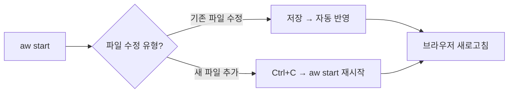

# Teamcenter Active Workspace Client (AWC) 2506 개발 가이드

> **대상 독자:** Java 백엔드 / Enovia 개발 경험이 있는 개발자  
> **버전:** Teamcenter 2506  
> **참고 자료:** YouTube 시리즈 "Ground Up"

---

## 목차

1. [AWC 개발 환경 소개](#1-awc-개발-환경-소개)
2. [커스텀 모듈 생성 (Legacy `npm run`)](#2-커스텀-모듈-생성-legacy-npm-run)
3. [커스텀 모듈 삭제](#3-커스텀-모듈-삭제)
4. [새로운 `aw` CLI 도구](#4-새로운-aw-cli-도구)
5. [개발 서버 활용 (Hot Reload)](#5-개발-서버-활용-hot-reload)

---

## 1. AWC 개발 환경 소개

### 1.1 기술 스택

| 항목 | 설명 |
|:-----|:-----|
| **프레임워크** | React 기반 (GWT에서 완전 전환) |
| **개발 방식** | OOTB 컴포넌트 + XML/JSON/HTML/CSS 설정 변경 중심 |
| **IDE** | Visual Studio Code (권장), IntelliJ 사용 가능 |

### 1.2 핵심 디렉토리 구조

```
TC_ROOT/
└── aws2/
    └── stage/              ← 개발 샌드박스 (로컬 복사 가능)
        ├── src/            ← ⭐ 커스터마이징 작업 공간
        ├── out/            ← 빌드 결과물
        ├── bin/            ← npm 및 스크립트
        └── solution/       ← 워크스페이스 기여 파일
```

### 1.3 개발 환경 초기화

```batch
# 1. stage 디렉토리로 이동
cd %TC_ROOT%\aws2\stage

# 2. 환경 변수 초기화 (필수)
initenv.cmd

# 3. 주요 명령어
npm run audit       # 코드 검사
npm run build       # 전체 빌드
npm run publish     # 서버 배포
```ini

> 💡 **Enovia 개발자 팁:** AWC는 프론트엔드(React/Node.js) 중심의 파일 시스템 기반 개발입니다. Java 백엔드 로직보다 `src` 폴더 내 JSON/XML 설정이 주요 작업입니다.

---

## 2. 커스텀 모듈 생성 (Legacy `npm run`)

### 2.1 핵심 개념

| 용어 | 설명 | Enovia 매핑 |
|:-----|:-----|:------------|
| **Kit (키트)** | 모듈을 묶는 최상위 정의 (`kit.json`) | 애플리케이션/프로젝트 |
| **Module (모듈)** | 커스터마이징 내용을 담는 컨테이너 | 기능 그룹 |
| **Command (커맨드)** | UI 버튼/메뉴 | UI 메뉴/버튼 |

### 2.2 생성 프로세스

#### Step 1: 키트 생성

```bash
npm run generateModule
# → 유형: kit
# → 이름: T7kit (접두어 사용 권장)
```

**결과:** `src/T7kit/kit.json` 생성

#### Step 2: 모듈 생성

```bash
npm run generateModule
# → 유형: module
# → 이름: myT7module
# → 키트 선택: T7kit
```

**결과:** `src/myT7module/module.json` 생성

#### Step 3: 커맨드 추가

```bash
npm run generateModule
# → 유형: command
# → select a module to modify: myT7module
# → ID: myT7command
# → Icon Name: cmd12YellowGlossyPlastic
# → Placement Name: aw_globalNavigationbar (F12로 ID(anchor) 확인)
```

**결과:** `commandsViewModel.json` 등 생성

### 2.3 빌드 및 배포

```bash
# 개별 실행
npm run audit       # 1. 코드 검사
npm run build       # 2. 빌드 (~5분)
npm run publish     # 3. 배포 (site.zip 생성)

# 또는 통합 명령어
aw build            # Audit + Build + Publish
```

---

## 3. 커스텀 모듈 삭제

### 3.1 삭제 프로세스

```
1. 소스 폴더 정리
   └── src/T7kit 폴더 삭제 또는 이동

2. 의존성 확인
   └── solution/kit.json에서 잔여 참조 확인

3. 빌드 및 배포
   └── aw build
```

> ⚠️ **주의:** 별도의 Uninstall 명령어 없음. 폴더를 물리적으로 제거하는 방식입니다.

### 3.2 모듈화의 중요성

- Enovia 개발 시 Core 파일을 건드리지 않고 별도 Schema/JPO로 격리하는 것처럼
- AWC에서도 **자신만의 Kit와 Module 폴더**를 만들어 개발해야 삭제/유지보수 용이

---

## 4. 새로운 `aw` CLI 도구

### 4.1 특징 및 장점

| 항목 | Legacy (`npm run`) | New (`aw`) |
|:-----|:-------------------|:-----------|
| **인터페이스** | 텍스트 기반 | 대화형 + 검색/필터링 |
| **구조 생성** | 기본 파일만 | 하위 폴더 자동 구성 |
| **오타 방지** | 직접 입력 | 자동 완성 지원 |

### 4.2 주요 명령어

```bash
# 키트 생성
aw add kit
# → 이름: T7_kit

# 모듈 생성
aw module
# → 이름: T7_module

# 커맨드 추가
aw add command
# → 아이콘: gls 입력 후 선택
# → 제목: Custom Command
# → 유형: Simple → Popup
# → 위치: Global 검색 → global navigation bar 선택

# 빌드
aw build
```

### 4.3 자동 생성 구조

```
src/T7_module/
├── html/
├── i18n/
├── js/
├── viewmodel/
└── commandsViewModel.json
```

> 💡 **비유:** `npm run`이 텍스트 파일 생성 수준이라면, `aw`는 **Spring Initializr**나 **IntelliJ 프로젝트 마법사** 수준입니다.

---

## 5. 개발 서버 활용 (Hot Reload)

### 5.1 Dev Server 개요

| 항목 | 설명 |
|:-----|:-----|
| **역할** | 개발자 전용 대체 인터페이스 (포트 3001) |
| **핵심 기능** | 파일 수정 시 즉시 반영 (Hot Reload) |
| **주의사항** | 파일 추가/삭제 시 서버 재시작 필요 |

### 5.2 실행 방법

```bash
# 1. 환경 초기화
initenv

# 2. 개발 서버 시작
aw start

# → http://localhost:3001 접속
# → 터미널은 "Watching" 상태 유지
```

### 5.3 워크플로우 비교

| 구분 | Full Build | Dev Server (Hot Reload) |
|:-----|:-----------|:------------------------|
| **명령어** | `aw build` | `aw start` (최초 1회) |
| **소요 시간** | 5~10분 | 수초~1분 |
| **적합한 작업** | 최종 배포, 모듈 추가/삭제 | UI 수정, 로직 변경 |
| **확인 포트** | 3000 | 3001 |

### 5.4 개발 시나리오



> 💡 **Java 비유:** `aw build`는 WAR 전체 재배포, `aw start`는 **JRebel** 또는 **Debug Mode**와 유사합니다.

---

## 참고 링크

| 번호 | 영상 제목 | YouTube |
|:----:|:---------|:--------|
| 1 | Introduction to AWC Development | [🔗](https://www.youtube.com/watch?v=UDdV6Mxosqg) |
| 2 | Create a Custom Module with Legacy 'npm run' | [🔗](https://www.youtube.com/watch?v=yJ5tWSNq8kU) |
| 3 | Remove Custom Module (Legacy) | [🔗](https://www.youtube.com/watch?v=NNFrUoM3GVE) |
| 4 | Explore Enhanced 'aw' Tools | [🔗](https://www.youtube.com/watch?v=SLTDp2H9JVQ) |
| 5 | Remove a Custom Module (aw) | [🔗](https://www.youtube.com/watch?v=aSOu_oFUxag) |
| 6 | Development Server (Hot Reload) | [🔗](https://www.youtube.com/watch?v=sUW_k0emyvc) |

---

*Last Updated: 2025-12-10*
