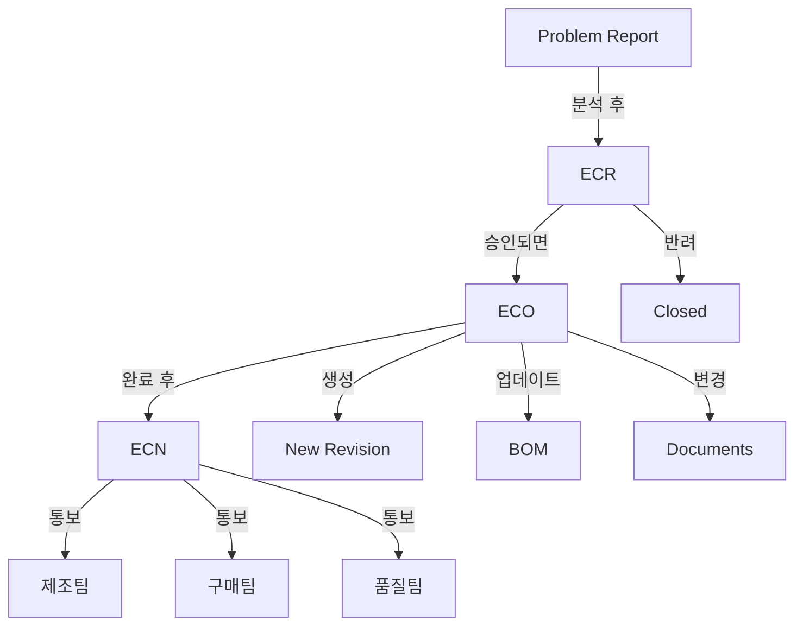
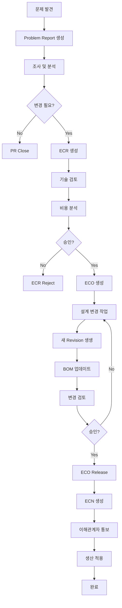

# Teamcenter Change Management 상세 가이드

> **작성일**: 2025-11-25  
> **목적**: Teamcenter Change Management의 특징, 강점, 실무 활용법 이해

---

## 📋 목차

1. [Change Management 개요](#change-management-개요)
2. [Change 객체 종류](#change-객체-종류)
3. [Change 프로세스 흐름](#change-프로세스-흐름)
4. [Teamcenter의 핵심 강점](#teamcenter의-핵심-강점)
5. [Effectivity 관리](#effectivity-관리)
6. [Impact Analysis (영향 분석)](#impact-analysis-영향-분석)
7. [ENOVIA와 비교](#enovia와-비교)
8. [실무 예제 코드](#실무-예제-코드)
9. [Best Practices](#best-practices)

---

## Change Management 개요

### 왜 Change Management가 중요한가?

제조업에서 제품이 출시된 후 변경이 필요한 경우가 빈번합니다:
- 설계 결함 발견
- 고객 요구사항 변경
- 부품 단종으로 인한 대체
- 원가 절감
- 법규 준수

**체계적인 변경 관리 없이는:**
- ❌ 어떤 제품에 변경이 적용되었는지 불명확
- ❌ 변경 이력 추적 불가
- ❌ 영향 받는 다른 부품 파악 어려움
- ❌ 승인 없는 임의 변경
- ❌ 재고와 설계 불일치

**Teamcenter Change Management의 목표:**
- ✅ 모든 변경을 추적 가능하게
- ✅ 영향 받는 항목 자동 분석
- ✅ 승인 프로세스 강제
- ✅ 유효성(Effectivity) 관리
- ✅ 변경 이력 완벽 보존

---

## Change 객체 종류

Teamcenter는 **여러 단계의 Change 객체**를 제공합니다.

### 1. Problem Report (문제 보고)

```
목적: 문제 발견 및 기록
담당: 누구나 (현장, 품질팀, 고객 등)
상태: Open → Under Investigation → Closed
```

**활용 시나리오:**
- 고객 클레임
- 제조 현장에서 불량 발견
- 테스트 중 문제 발견

### 2. ECR (Engineering Change Request) - 변경 요청

```
목적: 변경 필요성 제안 및 검토
담당: 엔지니어, 프로젝트 매니저
상태: Submitted → Under Review → Approved/Rejected
```

**활용 시나리오:**
- 원가 절감 제안
- 성능 개선 아이디어
- 설계 변경 제안

### 3. ECO (Engineering Change Order) - 변경 명령

```
목적: 승인된 변경의 실행
담당: 설계팀
상태: In Work → In Review → Released
```

**활용 시나리오:**
- ECR 승인 후 실제 설계 변경 수행
- 도면, BOM, 부품 Revision 변경

### 4. ECN (Engineering Change Notice) - 변경 통지

```
목적: 변경 사항 통보 및 배포
담당: 생산팀, 구매팀, 품질팀
상태: Released → Distributed
```

**활용 시나리오:**
- 제조 현장에 변경 사항 통보
- 공급업체에 부품 사양 변경 통지

### 관계도



---

## Change 프로세스 흐름

### 전체 프로세스 (실제 제조업 예시)



### 단계별 상세 설명

#### Phase 1: 문제 식별 (Problem Report)

```c
// Problem Report 생성
int create_problem_report(char* problem_desc, tag_t* pr_out) {
    int ifail = ITK_ok;
    tag_t pr_tag = NULLTAG;
    tag_t pr_type = NULLTAG;
    tag_t current_user = NULLTAG;
    
    // Problem Report Type 찾기
    ifail = TCTYPE_find_type("ProblemReport", "ProblemReport", &pr_type);
    ERROR_CHECK(ifail);
    
    // PR 생성
    ifail = TCTYPE_create_object(pr_type, &pr_tag);
    ERROR_CHECK(ifail);
    
    // 속성 설정
    ifail = SA_ask_user_login(&current_user);
    
    ifail = AOM_set_value_string(pr_tag, "object_name", 
                                  "Brake Pedal Failure");
    ifail = AOM_set_value_string(pr_tag, "problem_description", problem_desc);
    ifail = AOM_set_value_string(pr_tag, "severity", "Critical");
    ifail = AOM_set_value_tag(pr_tag, "reporter", current_user);
    
    // 날짜 설정
    date_t current_date;
    TCTYPE_get_current_time(&current_date);
    ifail = AOM_set_value_date(pr_tag, "report_date", current_date);
    
    // 저장
    ifail = AOM_save(pr_tag);
    ERROR_CHECK(ifail);
    
    *pr_out = pr_tag;
    
    TC_write_syslog("Problem Report created\n");
    
    return ITK_ok;
}
```

#### Phase 2: 변경 요청 (ECR)

```c
// ECR 생성 (Problem Report 연결)
int create_ecr_from_pr(tag_t pr_tag, tag_t problem_item, tag_t* ecr_out) {
    int ifail = ITK_ok;
    tag_t ecr_tag = NULLTAG;
    tag_t ecr_type = NULLTAG;
    tag_t rel_type = NULLTAG;
    
    // ECR Type
    ifail = TCTYPE_find_type("ChangeRequest", "ChangeRequest", &ecr_type);
    ERROR_CHECK(ifail);
    
    // ECR 생성
    ifail = TCTYPE_create_object(ecr_type, &ecr_tag);
    ERROR_CHECK(ifail);
    
    // 속성 설정
    ifail = AOM_set_value_string(ecr_tag, "object_name", 
                                  "ECR: Redesign Brake Pedal");
    ifail = AOM_set_value_string(ecr_tag, "change_type", "Design Change");
    ifail = AOM_set_value_string(ecr_tag, "reason_for_change", 
                                  "Material failure under stress");
    ifail = AOM_set_value_string(ecr_tag, "proposed_solution", 
                                  "Change material from plastic to aluminum");
    
    // Problem Report 연결
    ifail = GRM_find_relation_type("CMReferences", &rel_type);
    ifail = GRM_create_relation(ecr_tag, pr_tag, rel_type, NULLTAG, NULLTAG);
    
    // 문제 항목 연결 (CMHasProblemItem)
    ifail = GRM_find_relation_type("CMHasProblemItem", &rel_type);
    ifail = GRM_create_relation(ecr_tag, problem_item, rel_type, 
                                 NULLTAG, NULLTAG);
    
    // 저장
    ifail = AOM_save(ecr_tag);
    ERROR_CHECK(ifail);
    
    *ecr_out = ecr_tag;
    
    TC_write_syslog("ECR created and linked to Problem Report\n");
    
    return ITK_ok;
}
```

#### Phase 3: 변경 실행 (ECO)

```c
// ECO 생성 (ECR 승인 후)
int create_eco_from_ecr(tag_t ecr_tag, tag_t* eco_out) {
    int ifail = ITK_ok;
    tag_t eco_tag = NULLTAG;
    tag_t eco_type = NULLTAG;
    tag_t rel_type = NULLTAG;
    
    int n_problem_items = 0;
    tag_t* problem_items = NULL;
    
    // ECO Type
    ifail = TCTYPE_find_type("ChangeNotice", "ChangeNotice", &eco_type);
    ERROR_CHECK(ifail);
    
    // ECO 생성
    ifail = TCTYPE_create_object(eco_type, &eco_tag);
    ERROR_CHECK(ifail);
    
    // 속성 설정
    ifail = AOM_set_value_string(eco_tag, "object_name", 
                                  "ECO: Brake Pedal Material Change");
    ifail = AOM_set_value_string(eco_tag, "object_desc", 
                                  "Implementation of ECR-2025-001");
    
    // ECR 참조
    ifail = GRM_find_relation_type("CMReferences", &rel_type);
    ifail = GRM_create_relation(eco_tag, ecr_tag, rel_type, NULLTAG, NULLTAG);
    
    // ECR의 Problem Item들을 ECO에도 연결
    ifail = GRM_find_relation_type("CMHasProblemItem", &rel_type);
    ifail = GRM_list_secondary_objects_only(ecr_tag, rel_type, 
                                             &n_problem_items, &problem_items);
    
    // ECO의 Solution Item으로 추가
    ifail = GRM_find_relation_type("CMHasSolutionItem", &rel_type);
    
    for(int i = 0; i < n_problem_items; i++) {
        // 새 Revision 생성
        tag_t item_tag = NULLTAG;
        tag_t new_revision = NULLTAG;
        
        ifail = ITEM_ask_item_of_rev(problem_items[i], &item_tag);
        ifail = ITEM_create_rev(item_tag, "B", NULL, 
                                "Material changed per ECO", &new_revision);
        
        // 새 Revision을 Solution Item으로 연결
        ifail = GRM_create_relation(eco_tag, new_revision, rel_type, 
                                     NULLTAG, NULLTAG);
        
        TC_write_syslog("Created new revision for solution\n");
    }
    
    MEM_free(problem_items);
    
    // 저장
    ifail = AOM_save(eco_tag);
    ERROR_CHECK(ifail);
    
    *eco_out = eco_tag;
    
    TC_write_syslog("ECO created with solution items\n");
    
    return ITK_ok;
}
```

---

## Teamcenter의 핵심 강점

### 1. 🎯 Impact Analysis (영향 분석)

Teamcenter의 **가장 강력한 기능** 중 하나입니다.

#### 자동 영향 항목 탐지

```c
// 변경의 영향을 받는 모든 항목 찾기
int analyze_change_impact(tag_t changed_item) {
    int ifail = ITK_ok;
    
    // Where-Used 분석 (이 부품을 사용하는 상위 조립품)
    int n_parents = 0;
    tag_t* parent_items = NULL;
    
    ifail = WSOM_where_used(changed_item, 1, &n_parents, &parent_items);
    
    TC_write_syslog("\n=== Impact Analysis ===\n");
    TC_write_syslog("Items affected by this change:\n");
    
    for(int i = 0; i < n_parents; i++) {
        char* item_id = NULL;
        char* name = NULL;
        char* status = NULL;
        
        ifail = AOM_ask_value_string(parent_items[i], "item_id", &item_id);
        ifail = AOM_ask_value_string(parent_items[i], "object_name", &name);
        ifail = AOM_ask_value_string(parent_items[i], "release_status_list", 
                                      &status);
        
        TC_write_syslog("  - %s (%s) - Status: %s\n", 
                        item_id, name, status ? status : "None");
        
        // Released 상태인 경우 경고
        if(status && strcmp(status, "Released") == 0) {
            TC_write_syslog("    ⚠️ WARNING: This is a released item!\n");
        }
        
        MEM_free(item_id);
        MEM_free(name);
        MEM_free(status);
    }
    
    TC_write_syslog("Total affected items: %d\n", n_parents);
    
    MEM_free(parent_items);
    
    return ITK_ok;
}
```

#### Impact Analysis Matrix

Teamcenter는 다음을 자동으로 분석합니다:

| 분석 항목 | 설명 | 예시 |
|----------|------|------|
| **Where-Used** | 이 부품을 사용하는 상위 조립품 | 볼트 변경 → 10개 조립품 영향 |
| **BOM Impact** | BOM 구조 변경 영향 | 부품 삭제 → 하위 50개 부품 |
| **Document Impact** | 관련 문서 (도면, 사양서) | 치수 변경 → 3개 도면 수정 필요 |
| **Manufacturing Impact** | 공정, 공구 영향 | 재질 변경 → 5개 공정 변경 |
| **Project Impact** | 프로젝트 일정 영향 | 설계 변경 → 3주 지연 |

### 2. 🔄 Redlining & Markup

변경 전후 비교 및 마크업 기능

```c
// Redline 생성 (변경 사항 표시)
int create_redline(tag_t original_dataset, tag_t modified_dataset) {
    int ifail = ITK_ok;
    tag_t redline_tag = NULLTAG;
    
    // Visualization 모듈 사용 (CAD 파일 비교)
    // 변경된 부분을 빨간색으로 표시
    
    TC_write_syslog("Redline created for visual comparison\n");
    
    return ITK_ok;
}
```

### 3. 📊 Effectivity Management (유효성 관리)

**Teamcenter의 독보적인 강점!**

#### Effectivity 타입

1. **Serial Number Effectivity** (일련번호 기준)
   ```
   예: "Serial 1001부터 적용"
   → 1001번 제품부터 새 부품 사용
   ```

2. **Date Effectivity** (날짜 기준)
   ```
   예: "2025-12-01부터 적용"
   → 12월 1일 이후 생산분부터 적용
   ```

3. **Unit Effectivity** (단위 기준)
   ```
   예: "Lot 50부터 적용"
   → 50차 생산분부터 적용
   ```

#### Effectivity 설정 코드

```c
// Serial Effectivity 설정
int set_serial_effectivity(tag_t bom_line, int from_serial, int to_serial) {
    int ifail = ITK_ok;
    tag_t effectivity_tag = NULLTAG;
    
    // Effectivity 생성
    ifail = EFF_create_effectivity(
        "Serial",
        &effectivity_tag
    );
    
    // 범위 설정
    char from_str[32], to_str[32];
    sprintf(from_str, "%d", from_serial);
    sprintf(to_str, "%d", to_serial);
    
    ifail = EFF_set_effectivity_values(
        effectivity_tag,
        from_str,  // "1001"
        to_str     // "UP" (끝까지) 또는 특정 번호
    );
    
    // BOM Line에 적용
    ifail = BOM_line_set_effectivity(bom_line, effectivity_tag);
    
    TC_write_syslog("Effectivity set: Serial %d to %s\n", 
                    from_serial, to_serial == -1 ? "UP" : to_str);
    
    return ITK_ok;
}

// Date Effectivity 설정
int set_date_effectivity(tag_t bom_line, date_t effective_date) {
    int ifail = ITK_ok;
    tag_t effectivity_tag = NULLTAG;
    
    ifail = EFF_create_effectivity("Date", &effectivity_tag);
    
    // 날짜 설정
    char date_str[32];
    DATE_date_to_string(effective_date, date_str);
    
    ifail = EFF_set_effectivity_values(effectivity_tag, date_str, "UP");
    ifail = BOM_line_set_effectivity(bom_line, effectivity_tag);
    
    TC_write_syslog("Effectivity set: Date %s to UP\n", date_str);
    
    return ITK_ok;
}
```

#### Effectivity 활용 시나리오

```
시나리오: 자동차 엔진 부품 변경

제품: Car Model X
변경: 엔진 볼트 재질 변경 (Steel → Titanium)

Effectivity 설정:
  - Old Bolt (Steel): Serial 1 ~ 5000
  - New Bolt (Titanium): Serial 5001 ~ UP

결과:
  - Serial 1~5000: Steel 볼트 사용 (이미 생산/출고)
  - Serial 5001 이후: Titanium 볼트 사용
  - BOM은 하나인데, Serial에 따라 다른 부품 자동 적용!
```

### 4. 🔐 Change Review & Approval

강력한 멀티레벨 승인 시스템

```c
// Multi-level Approval Workflow Handler
extern int HANDLER_change_approval(EPM_action_message_t msg) {
    int ifail = ITK_ok;
    int n_attachments = 0;
    tag_t* attachments = NULL;
    
    // 변경 객체 가져오기
    ifail = EPM_ask_attachments(msg.task, EPM_target_attachment,
                                 &n_attachments, &attachments);
    
    for(int i = 0; i < n_attachments; i++) {
        char* change_type = NULL;
        double estimated_cost = 0.0;
        
        // 변경 타입 확인
        ifail = AOM_ask_value_string(attachments[i], "change_type", 
                                      &change_type);
        
        // 예상 비용 확인
        ifail = AOM_ask_value_double(attachments[i], "estimated_cost", 
                                      &estimated_cost);
        
        // 비용에 따라 다른 승인 경로
        if(estimated_cost > 100000.0) {
            // 고비용 변경: CEO 승인 필요
            TC_write_syslog("High-cost change: CEO approval required\n");
            ifail = EPM_add_comment(msg.task, 
                "고비용 변경으로 CEO 승인이 필요합니다.");
        } else if(estimated_cost > 10000.0) {
            // 중비용: 부서장 승인
            TC_write_syslog("Medium-cost change: Manager approval required\n");
        } else {
            // 저비용: 팀장 승인
            TC_write_syslog("Low-cost change: Team lead approval sufficient\n");
        }
        
        MEM_free(change_type);
    }
    
    MEM_free(attachments);
    
    return ITK_ok;
}
```

### 5. 📝 Change History & Traceability

완벽한 변경 이력 추적

```c
// 부품의 모든 변경 이력 조회
int get_change_history(tag_t item_revision) {
    int ifail = ITK_ok;
    tag_t item_tag = NULLTAG;
    int n_revisions = 0;
    tag_t* revisions = NULL;
    
    // Item 가져오기
    ifail = ITEM_ask_item_of_rev(item_revision, &item_tag);
    
    // 모든 Revision 조회
    ifail = ITEM_list_all_revs(item_tag, &n_revisions, &revisions);
    
    TC_write_syslog("\n=== Change History ===\n");
    
    for(int i = 0; i < n_revisions; i++) {
        char* rev_id = NULL;
        char* desc = NULL;
        date_t creation_date;
        char date_str[32];
        tag_t* change_objects = NULL;
        int n_changes = 0;
        tag_t rel_type = NULLTAG;
        
        // Revision 정보
        ifail = AOM_ask_value_string(revisions[i], "item_revision_id", &rev_id);
        ifail = AOM_ask_value_string(revisions[i], "object_desc", &desc);
        ifail = AOM_ask_value_date(revisions[i], "creation_date", &creation_date);
        DATE_date_to_string(creation_date, date_str);
        
        TC_write_syslog("\nRevision %s (%s):\n", rev_id, date_str);
        TC_write_syslog("  Description: %s\n", desc ? desc : "N/A");
        
        // 이 Revision과 연결된 변경 객체 찾기
        ifail = GRM_find_relation_type("CMHasSolutionItem", &rel_type);
        ifail = GRM_list_primary_objects_only(revisions[i], rel_type,
                                               &n_changes, &change_objects);
        
        if(n_changes > 0) {
            TC_write_syslog("  Related Changes:\n");
            
            for(int j = 0; j < n_changes; j++) {
                char* change_name = NULL;
                char* change_desc = NULL;
                
                ifail = AOM_ask_value_string(change_objects[j], "object_name", 
                                              &change_name);
                ifail = AOM_ask_value_string(change_objects[j], "object_desc", 
                                              &change_desc);
                
                TC_write_syslog("    - %s: %s\n", 
                                change_name, change_desc ? change_desc : "N/A");
                
                MEM_free(change_name);
                MEM_free(change_desc);
            }
            
            MEM_free(change_objects);
        }
        
        MEM_free(rev_id);
        MEM_free(desc);
    }
    
    MEM_free(revisions);
    
    return ITK_ok;
}
```

---

## Effectivity 관리

### 실무 예제: 자동차 모델별 BOM

```c
// 같은 플랫폼에서 여러 모델 관리
int setup_variant_bom() {
    int ifail = ITK_ok;
    tag_t bom_window = NULLTAG;
    tag_t top_line = NULLTAG;
    tag_t engine_line = NULLTAG;
    
    // BOM Window 생성
    ifail = BOM_create_window(&bom_window);
    
    // 기본 차량 BOM
    ifail = BOM_set_window_top_line(bom_window, NULL, car_base_rev, 
                                     NULLTAG, &top_line);
    
    // 엔진 라인 추가 (여러 옵션)
    tag_t engine_2000cc = NULLTAG;  // 2.0L 엔진
    tag_t engine_2500cc = NULLTAG;  // 2.5L 엔진
    tag_t engine_electric = NULLTAG;  // 전기 모터
    
    // 2.0L 엔진 - Serial 1~10000
    ifail = BOM_line_add(top_line, engine_2000cc, NULLTAG, &engine_line);
    ifail = set_serial_effectivity(engine_line, 1, 10000);
    
    // 2.5L 엔진 - Serial 10001~20000
    ifail = BOM_line_add(top_line, engine_2500cc, NULLTAG, &engine_line);
    ifail = set_serial_effectivity(engine_line, 10001, 20000);
    
    // 전기 모터 - Serial 20001~UP
    ifail = BOM_line_add(top_line, engine_electric, NULLTAG, &engine_line);
    ifail = set_serial_effectivity(engine_line, 20001, -1);  // UP
    
    // 저장
    ifail = BOM_save_window(bom_window);
    ifail = BOM_close_window(bom_window);
    
    TC_write_syslog("Variant BOM created with effectivity\n");
    
    return ITK_ok;
}

// 특정 Serial의 BOM 조회
int get_effective_bom(tag_t item_rev, int serial_number) {
    int ifail = ITK_ok;
    tag_t bom_window = NULLTAG;
    tag_t top_line = NULLTAG;
    tag_t revision_rule = NULLTAG;
    
    // Revision Rule 설정 (Serial 기준)
    char serial_str[32];
    sprintf(serial_str, "%d", serial_number);
    
    ifail = BOM_create_window(&bom_window);
    
    // Effectivity 설정
    ifail = BOM_set_window_config_effectivity(bom_window, serial_str, "Serial");
    
    // BOM 로드
    ifail = BOM_set_window_top_line(bom_window, NULL, item_rev, 
                                     NULLTAG, &top_line);
    
    // 자식 라인 조회 (Effectivity 필터링됨!)
    int n_children = 0;
    tag_t* children = NULL;
    
    ifail = BOM_line_ask_child_lines(top_line, &n_children, &children);
    
    TC_write_syslog("\n=== Effective BOM for Serial %d ===\n", serial_number);
    
    for(int i = 0; i < n_children; i++) {
        tag_t child_rev = NULLTAG;
        char* item_id = NULL;
        char* name = NULL;
        
        ifail = BOM_line_ask_child_item_revision(children[i], &child_rev);
        ifail = AOM_ask_value_string(child_rev, "item_id", &item_id);
        ifail = AOM_ask_value_string(child_rev, "object_name", &name);
        
        TC_write_syslog("  - %s: %s\n", item_id, name);
        
        MEM_free(item_id);
        MEM_free(name);
    }
    
    MEM_free(children);
    ifail = BOM_close_window(bom_window);
    
    return ITK_ok;
}
```

---

## Impact Analysis (영향 분석)

### Teamcenter의 Impact Analysis 기능

```c
// 종합 영향 분석 함수
int comprehensive_impact_analysis(tag_t change_object) {
    int ifail = ITK_ok;
    int n_problem_items = 0;
    tag_t* problem_items = NULL;
    tag_t rel_type = NULLTAG;
    
    TC_write_syslog("\n");
    TC_write_syslog("========================================\n");
    TC_write_syslog("  COMPREHENSIVE IMPACT ANALYSIS\n");
    TC_write_syslog("========================================\n");
    
    // 1. Problem Items 가져오기
    ifail = GRM_find_relation_type("CMHasProblemItem", &rel_type);
    ifail = GRM_list_secondary_objects_only(change_object, rel_type,
                                             &n_problem_items, &problem_items);
    
    for(int i = 0; i < n_problem_items; i++) {
        char* item_id = NULL;
        ifail = AOM_ask_value_string(problem_items[i], "item_id", &item_id);
        
        TC_write_syslog("\n--- Analyzing: %s ---\n", item_id);
        
        // 2. Where-Used Analysis
        int n_parents = 0;
        tag_t* parent_items = NULL;
        
        ifail = WSOM_where_used(problem_items[i], 1, &n_parents, &parent_items);
        
        TC_write_syslog("\n1. WHERE-USED IMPACT: %d items\n", n_parents);
        
        for(int j = 0; j < n_parents; j++) {
            char* parent_id = NULL;
            char* parent_name = NULL;
            
            ifail = AOM_ask_value_string(parent_items[j], "item_id", &parent_id);
            ifail = AOM_ask_value_string(parent_items[j], "object_name", 
                                          &parent_name);
            
            TC_write_syslog("  ↑ %s (%s)\n", parent_id, parent_name);
            
            MEM_free(parent_id);
            MEM_free(parent_name);
        }
        
        MEM_free(parent_items);
        
        // 3. Document Impact (연결된 문서)
        int n_datasets = 0;
        tag_t* datasets = NULL;
        
        ifail = GRM_find_relation_type("IMAN_specification", &rel_type);
        ifail = GRM_list_secondary_objects_only(problem_items[i], rel_type,
                                                 &n_datasets, &datasets);
        
        TC_write_syslog("\n2. DOCUMENT IMPACT: %d documents\n", n_datasets);
        
        for(int j = 0; j < n_datasets; j++) {
            char* dataset_name = NULL;
            char* dataset_type = NULL;
            
            ifail = AOM_ask_value_string(datasets[j], "object_name", 
                                          &dataset_name);
            ifail = WSOM_ask_object_type2(datasets[j], &dataset_type);
            
            TC_write_syslog("  📄 %s (Type: %s)\n", dataset_name, dataset_type);
            
            MEM_free(dataset_name);
            MEM_free(dataset_type);
        }
        
        MEM_free(datasets);
        
        // 4. BOM Impact (하위 부품)
        tag_t item_tag = NULLTAG;
        int total_child_count = 0;
        
        ifail = ITEM_ask_item_of_rev(problem_items[i], &item_tag);
        
        // BOM 구조 분석
        tag_t bom_window = NULLTAG;
        tag_t top_line = NULLTAG;
        
        ifail = BOM_create_window(&bom_window);
        ifail = BOM_set_window_top_line(bom_window, NULL, problem_items[i],
                                         NULLTAG, &top_line);
        
        // 재귀적으로 모든 자식 카운트
        count_all_bom_children(top_line, &total_child_count);
        
        TC_write_syslog("\n3. BOM IMPACT: %d child items\n", total_child_count);
        
        ifail = BOM_close_window(bom_window);
        
        // 5. Project Impact (연결된 프로젝트)
        // (프로젝트 관리 모듈 사용 시)
        
        MEM_free(item_id);
    }
    
    MEM_free(problem_items);
    
    TC_write_syslog("\n========================================\n");
    TC_write_syslog("  ANALYSIS COMPLETE\n");
    TC_write_syslog("========================================\n\n");
    
    return ITK_ok;
}

// BOM 자식 재귀 카운트
void count_all_bom_children(tag_t bom_line, int* count) {
    int ifail;
    int n_children = 0;
    tag_t* children = NULL;
    
    ifail = BOM_line_ask_child_lines(bom_line, &n_children, &children);
    
    *count += n_children;
    
    // 재귀적으로 손자, 증손자도 카운트
    for(int i = 0; i < n_children; i++) {
        count_all_bom_children(children[i], count);
    }
    
    MEM_free(children);
}
```

---

## ENOVIA와 비교

### 기능 비교표

| 기능 | ENOVIA | Teamcenter | 승자 |
|------|--------|------------|------|
| **변경 객체 종류** | ECO, ECR, MCO | PR, ECR, ECO, ECN | 🏆 TC (더 세분화) |
| **Effectivity** | 제한적 | Serial/Date/Unit 완벽 지원 | 🏆 TC |
| **Impact Analysis** | 수동/제한적 | 자동/포괄적 | 🏆 TC |
| **Where-Used** | 가능 | 강력 (다단계 추적) | 🏆 TC |
| **Redlining** | 제한적 | CAD 통합 Redline | 🏆 TC |
| **변경 이력** | Revision 기반 | Revision + Change 객체 | 🏆 TC |
| **승인 프로세스** | Route (서명) | Workflow (Task) | 🤝 비슷 |
| **개발 복잡도** | Java (쉬움) | C/C++ (어려움) | 🏆 ENOVIA |
| **배포 편의성** | 핫디플로이 | 컴파일+재시작 | 🏆 ENOVIA |
| **CAD 통합** | 가능 | 강력 (NX, CATIA 등) | 🏆 TC |

### 프로세스 비교

#### ENOVIA 방식
```java
// 간단하지만 기능 제한적
ECO eco = new ECO(context);
eco.setName(context, "ECO-001");
eco.addAffectedItem(context, partId);
eco.promote(context);  // State 전환
```

#### Teamcenter 방식
```c
// 복잡하지만 강력
create_eco_from_ecr(ecr_tag, &eco_tag);
analyze_change_impact(eco_tag);  // 자동 영향 분석
set_serial_effectivity(bom_line, 5001, -1);  // Effectivity 설정
comprehensive_impact_analysis(eco_tag);
```

### 실무 관점 비교

| 측면 | ENOVIA | Teamcenter |
|------|--------|------------|
| **학습 곡선** | 완만 | 가파름 |
| **구현 속도** | 빠름 | 느림 |
| **기능 깊이** | 중간 | 매우 깊음 |
| **제조업 특화** | 일반적 | 매우 특화됨 |
| **자동차/항공** | 사용 가능 | 업계 표준 |
| **변경 추적** | 기본 | 엔터프라이즈급 |
| **Effectivity** | 약함 | 강력 |

---

## Best Practices

### 1. Change 객체 생성 규칙

```c
// ✅ GOOD: Problem → ECR → ECO 순서 준수
create_problem_report(desc, &pr);
create_ecr_from_pr(pr, item, &ecr);
// ECR 승인 후
create_eco_from_ecr(ecr, &eco);

// ❌ BAD: ECO 바로 생성 (추적 불가)
create_eco_directly(item, &eco);
```

### 2. Impact Analysis 필수

```c
// ✅ GOOD: 변경 전 영향 분석
int before_change(tag_t eco) {
    comprehensive_impact_analysis(eco);
    
    // 승인자에게 영향 분석 결과 첨부
    attach_impact_report_to_workflow(eco);
    
    start_eco_workflow(eco);
}

// ❌ BAD: 분석 없이 바로 변경
int bad_change(tag_t eco) {
    create_new_revision(problem_item);  // 위험!
}
```

### 3. Effectivity 활용

```c
// ✅ GOOD: 점진적 적용
set_serial_effectivity(old_part_line, 1, 5000);
set_serial_effectivity(new_part_line, 5001, -1);  // UP

// ❌ BAD: 모든 제품에 즉시 적용 (재고 문제)
replace_part_immediately(old_part, new_part);
```

### 4. 변경 이력 문서화

```c
// ✅ GOOD: 상세한 설명
AOM_set_value_string(eco, "object_desc",
    "Material change from Steel to Aluminum due to weight reduction. "
    "Impacts 15 parent assemblies. Effective from Serial 5001. "
    "Estimated cost savings: $50,000/year.");

// ❌ BAD: 빈약한 설명
AOM_set_value_string(eco, "object_desc", "Material change");
```

### 5. 승인 프로세스 자동화

```c
// ✅ GOOD: 조건별 자동 라우팅
extern int HANDLER_auto_route(EPM_action_message_t msg) {
    double cost;
    AOM_ask_value_double(change_object, "estimated_cost", &cost);
    
    if(cost > 100000) {
        route_to_ceo();
    } else if(cost > 10000) {
        route_to_manager();
    } else {
        route_to_team_lead();
    }
}
```

---

## 실무 종합 예제

### 시나리오: 브레이크 페달 긴급 변경

```c
// 완전한 Change Management 프로세스
extern int ITK_user_main(int argc, char* argv[]) {
    int ifail = ITK_ok;
    
    tag_t pr_tag = NULLTAG;
    tag_t ecr_tag = NULLTAG;
    tag_t eco_tag = NULLTAG;
    tag_t problem_item = NULLTAG;
    
    TC_write_syslog("\n=== Emergency Change Process ===\n");
    
    // 1. 문제 보고
    TC_write_syslog("\nPhase 1: Problem Report\n");
    
    ifail = create_problem_report(
        "Brake pedal cracking under stress test. "
        "Safety critical issue found in field testing.",
        &pr_tag
    );
    
    // 문제 부품 찾기
    ifail = ITEM_find_item("BRAKE-PEDAL-001", &problem_item);
    
    // 2. ECR 생성
    TC_write_syslog("\nPhase 2: Change Request\n");
    
    ifail = create_ecr_from_pr(pr_tag, problem_item, &ecr_tag);
    
    // 비용 분석
    ifail = AOM_set_value_double(ecr_tag, "estimated_cost", 75000.0);
    ifail = AOM_set_value_string(ecr_tag, "urgency", "Critical");
    ifail = AOM_save(ecr_tag);
    
    // ECR Workflow 시작
    TC_write_syslog("Starting ECR review workflow...\n");
    // start_ecr_workflow(ecr_tag);
    
    // 3. 영향 분석 (승인 전)
    TC_write_syslog("\nPhase 3: Impact Analysis\n");
    
    ifail = comprehensive_impact_analysis(ecr_tag);
    
    // 4. ECR 승인됨 (시뮬레이션)
    TC_write_syslog("\nPhase 4: ECR Approved\n");
    
    ifail = AOM_set_value_string(ecr_tag, "release_status_list", "Approved");
    ifail = AOM_save(ecr_tag);
    
    // 5. ECO 생성
    TC_write_syslog("\nPhase 5: Change Order\n");
    
    ifail = create_eco_from_ecr(ecr_tag, &eco_tag);
    
    // 6. Effectivity 설정
    TC_write_syslog("\nPhase 6: Effectivity Setup\n");
    
    // 현재 생산 중인 Serial: 4850
    // 재고 부품으로 5000대까지 생산 가능
    // 5001번부터 새 부품 적용
    
    TC_write_syslog("Current production serial: 4850\n");
    TC_write_syslog("Inventory covers up to serial: 5000\n");
    TC_write_syslog("New part effective from serial: 5001\n");
    
    // 7. ECO Release
    TC_write_syslog("\nPhase 7: ECO Release\n");
    
    ifail = AOM_set_value_string(eco_tag, "release_status_list", "Released");
    
    date_t current_date;
    TCTYPE_get_current_time(&current_date);
    ifail = AOM_set_value_date(eco_tag, "release_date", current_date);
    
    ifail = AOM_save(eco_tag);
    
    // 8. 변경 이력 조회
    TC_write_syslog("\nPhase 8: Change History\n");
    
    tag_t new_revision = NULLTAG;
    // get new revision from eco
    
    // ifail = get_change_history(new_revision);
    
    TC_write_syslog("\n=== Change Process Complete ===\n");
    TC_write_syslog("✓ Problem documented\n");
    TC_write_syslog("✓ Change approved\n");
    TC_write_syslog("✓ Impact analyzed\n");
    TC_write_syslog("✓ Effectivity set\n");
    TC_write_syslog("✓ History tracked\n");
    
    return ITK_ok;
}
```

---

## 정리

### Teamcenter Change Management의 핵심 강점

1. **🎯 Effectivity**: Serial/Date/Unit 기반 유효성 관리 (독보적)
2. **📊 Impact Analysis**: 자동화된 포괄적 영향 분석
3. **🔄 Change 객체 계층**: PR → ECR → ECO → ECN (체계적)
4. **📝 완벽한 추적성**: 모든 변경 이력 보존
5. **🔐 강력한 승인**: 다단계 조건부 승인 프로세스
6. **🏭 제조업 특화**: 자동차, 항공우주 등 표준

### ENOVIA vs Teamcenter: 언제 무엇을 선택?

**ENOVIA 추천:**
- 빠른 개발 필요
- 일반적인 PLM 요구사항
- Java 개발팀
- 중소 규모

**Teamcenter 추천:**
- 복잡한 Effectivity 필요
- 자동차/항공/방산 산업
- 엔터프라이즈급 확장성
- 심층 Impact Analysis 필요
- 대규모 조직

---

> **다음 학습**: Teamcenter Visualization, Multi-Site Configuration, Active Workspace Customization

**교육에서 Change Management에 집중하세요! 🎯**
