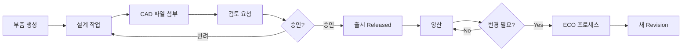
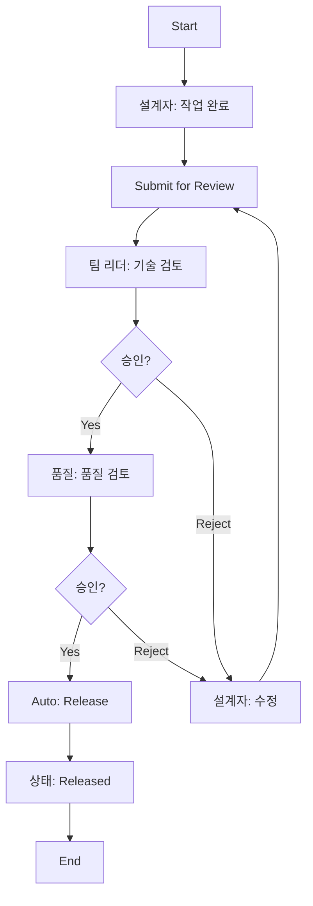
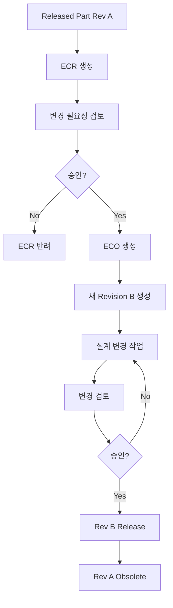

# Teamcenter 부품 생성 및 프로세스 관리 가이드

> **작성일**: 2025-11-25  
> **목적**: Teamcenter에서 부품을 생성하고 승인/출시 프로세스를 진행하는 전체 워크플로우 이해

---

## 📋 목차

1. [전체 프로세스 개요](#전체-프로세스-개요)
2. [부품 생성 단계](#부품-생성-단계)
3. [상태 관리 (Release Status)](#상태-관리-release-status)
4. [워크플로우 프로세스](#워크플로우-프로세스)
5. [변경 관리 (ECR/ECO)](#변경-관리-ecr-eco)
6. [ITK 코드로 구현하기](#itk-코드로-구현하기)
7. [ENOVIA와 비교](#enovia와-비교)

---

## 전체 프로세스 개요

### 일반적인 부품 라이프사이클



### Teamcenter의 핵심 개념

| 개념 | ENOVIA 대응 | 설명 |
|------|-------------|------|
| **Item** | Type | 부품의 마스터 정보 (변하지 않음) |
| **ItemRevision** | Object (with Policy) | 부품의 버전 (A, B, C...) |
| **Release Status** | Policy State | 부품의 상태 (Working, Review, Released 등) |
| **Workflow** | Route | 승인 프로세스 |
| **Dataset** | Document | CAD 파일, 문서 등 |
| **BOM** | EBOM | 부품 구조 |
| **ECR/ECO** | Change Object | 변경 요청/명령 |

---

## 부품 생성 단계

### 1. Item 및 ItemRevision 생성

#### GUI에서 생성 (일반 사용자)

```
1. Teamcenter RAC 또는 Active Workspace 접속
2. File > New > Item 선택
3. Item 정보 입력:
   - Item ID: PART-001234 (고유 ID)
   - Name: Motor Assembly
   - Type: Part (또는 커스텀 타입)
   - Revision: A (초기 리비전)
   - Description: 설명 입력
4. Create 버튼 클릭
```

#### ITK로 생성 (프로그래밍)

```c
#include <tc/tc.h>
#include <tccore/item.h>
#include <tccore/aom.h>

int create_new_part() {
    int ifail = ITK_ok;
    tag_t new_item = NULLTAG;
    tag_t new_revision = NULLTAG;
    tag_t owner_tag = NULLTAG;
    tag_t group_tag = NULLTAG;
    
    // 현재 사용자 및 그룹 가져오기
    ifail = SA_ask_user_login(&owner_tag);
    ifail = SA_ask_user_current_group(owner_tag, &group_tag);
    
    // Item 생성
    ifail = ITEM_create_item(
        "PART-001234",           // Item ID
        "Motor Assembly",        // Item Name
        "Part",                  // Item Type
        "A",                     // Revision ID
        &new_item,               // 생성된 Item Tag
        &new_revision            // 생성된 Revision Tag
    );
    
    if(ifail != ITK_ok) {
        char* err_msg = NULL;
        EMH_ask_error_text(ifail, &err_msg);
        TC_write_syslog("ERROR: %s\n", err_msg);
        MEM_free(err_msg);
        return ifail;
    }
    
    // 추가 속성 설정
    ifail = AOM_set_value_string(new_revision, "object_desc", 
                                  "High-performance motor for automotive");
    
    // Unit of Measure 설정
    ifail = ITEM_set_uom(new_item, "EA");  // Each
    
    // Owner 설정
    ifail = AOM_set_value_tag(new_revision, "owning_user", owner_tag);
    ifail = AOM_set_value_tag(new_revision, "owning_group", group_tag);
    
    // 저장
    ifail = AOM_save(new_item);
    ifail = AOM_save(new_revision);
    
    TC_write_syslog("Successfully created Item: PART-001234 Rev A\n");
    
    return ITK_ok;
}
```

### 2. 커스텀 속성 설정 (Form 사용)

```c
int set_custom_properties(tag_t item_revision) {
    int ifail = ITK_ok;
    tag_t form_tag = NULLTAG;
    tag_t form_type = NULLTAG;
    
    // Form Type 찾기 (BMIDE에서 정의된 커스텀 속성 그룹)
    ifail = TCTYPE_find_type("MY_Part_Form", "Form", &form_type);
    
    // Form 생성
    ifail = TCTYPE_create_object(form_type, &form_tag);
    
    // Form 속성 설정
    ifail = AOM_set_value_string(form_tag, "material", "Steel");
    ifail = AOM_set_value_string(form_tag, "supplier", "ABC Corp");
    ifail = AOM_set_value_double(form_tag, "weight", 2.5);  // kg
    
    ifail = AOM_save(form_tag);
    
    // ItemRevision에 Form 연결 (IMAN_manifestation 관계)
    tag_t rel_type = NULLTAG;
    ifail = GRM_find_relation_type("IMAN_manifestation", &rel_type);
    ifail = GRM_create_relation(item_revision, form_tag, rel_type, 
                                 NULLTAG, NULLTAG);
    
    TC_write_syslog("Custom properties set successfully\n");
    
    return ITK_ok;
}
```

### 3. CAD 파일 첨부 (Dataset)

```c
int attach_cad_file(tag_t item_revision, char* file_path) {
    int ifail = ITK_ok;
    tag_t dataset_tag = NULLTAG;
    tag_t dataset_type = NULLTAG;
    tag_t named_ref_tag = NULLTAG;
    tag_t rel_type = NULLTAG;
    
    // Dataset Type 찾기 (예: UGMASTER for NX CAD)
    ifail = TCTYPE_find_type("UGMASTER", "Dataset", &dataset_type);
    
    // Dataset 생성
    ifail = DATASET_create_dataset(
        dataset_type,
        "CAD_Model",             // Dataset 이름
        "3D CAD Model",          // 설명
        "NX",                    // Tool name
        &dataset_tag
    );
    
    // 파일 임포트
    ifail = AE_create_dataset_uifile(
        dataset_tag,
        "UGMASTER",              // Named Reference Type
        file_path,               // 로컬 파일 경로
        &named_ref_tag
    );
    
    // Dataset 저장
    ifail = AOM_save(dataset_tag);
    
    // ItemRevision에 Dataset 연결 (IMAN_specification 관계)
    ifail = GRM_find_relation_type("IMAN_specification", &rel_type);
    ifail = GRM_create_relation(item_revision, dataset_tag, rel_type,
                                 NULLTAG, NULLTAG);
    
    TC_write_syslog("CAD file attached: %s\n", file_path);
    
    return ITK_ok;
}
```

---

## 상태 관리 (Release Status)

### Release Status 개념

Teamcenter의 ItemRevision은 **Release Status**로 상태를 관리합니다.

#### ENOVIA와의 차이점

| ENOVIA Policy | Teamcenter Release Status |
|---------------|---------------------------|
| State Machine (고정 경로) | 유연한 상태 값 |
| Promote/Demote 메서드 | Workflow로 상태 변경 |
| Policy Trigger | User Exit, Workflow Handler |

### 일반적인 상태 값

```
1. Working (작업 중)
   └─ 설계자가 작업 중인 상태
   
2. In Review (검토 중)
   └─ 검토 워크플로우 진행 중
   
3. Approved (승인됨)
   └─ 검토 승인 완료, 출시 대기
   
4. Released (출시됨)
   └─ 정식 출시, 양산 가능
   
5. Obsolete (폐기됨)
   └─ 더 이상 사용하지 않음
```

### Release Status 확인 및 변경

```c
int check_and_update_status(tag_t item_revision) {
    int ifail = ITK_ok;
    char* current_status = NULL;
    int status_count = 0;
    char** status_list = NULL;
    
    // 현재 상태 조회
    ifail = AOM_ask_value_string(item_revision, "release_status_list", 
                                  &current_status);
    
    TC_write_syslog("Current Status: %s\n", 
                    current_status ? current_status : "None");
    
    // 상태 변경 (주의: 직접 변경보다는 Workflow 사용 권장!)
    if(current_status == NULL || strcmp(current_status, "") == 0) {
        // Working 상태로 설정
        ifail = AOM_set_value_string(item_revision, "release_status_list", 
                                      "Working");
        ifail = AOM_save(item_revision);
        
        TC_write_syslog("Status changed to: Working\n");
    }
    
    MEM_free(current_status);
    
    return ITK_ok;
}
```

> **중요**: 실무에서는 Release Status를 직접 변경하지 않고, **Workflow를 통해 변경**하는 것이 표준입니다.

---

## 워크플로우 프로세스

### Workflow 개념

Teamcenter의 Workflow는 ENOVIA의 Route와 유사하지만 훨씬 강력합니다.

#### Workflow 구성 요소

```
Workflow Process Template
├─ Process (전체 프로세스)
│   ├─ Task (작업 단위)
│   │   ├─ Assignee (담당자)
│   │   ├─ Performer (실행자)
│   │   └─ Action (승인/반려/보류)
│   ├─ Handler (자동 처리 로직)
│   │   ├─ Pre-Action Handler
│   │   └─ Post-Action Handler
│   └─ Rule (분기 조건)
└─ Subprocess (하위 프로세스)
```

### 일반적인 Release Workflow



### Workflow 시작 (ITK)

```c
int submit_for_review(tag_t item_revision) {
    int ifail = ITK_ok;
    tag_t workflow_template = NULLTAG;
    tag_t process_tag = NULLTAG;
    tag_t* attachments = NULL;
    int n_attachments = 1;
    char* process_name = NULL;
    
    // Workflow Template 찾기 (Workflow Designer에서 생성된 템플릿)
    ifail = EPM_find_process_template("Release_Review_Process", 
                                       &workflow_template);
    
    if(ifail != ITK_ok) {
        TC_write_syslog("ERROR: Workflow template not found\n");
        return ifail;
    }
    
    // 첨부 객체 설정
    attachments = (tag_t*)MEM_alloc(sizeof(tag_t) * 1);
    attachments[0] = item_revision;
    
    // Workflow 프로세스 시작
    ifail = EPM_create_process(
        workflow_template,
        "Review Process for Part",  // 프로세스 이름
        "Please review this part",  // 설명
        n_attachments,
        attachments,
        &process_tag
    );
    
    MEM_free(attachments);
    
    if(ifail != ITK_ok) {
        TC_write_syslog("ERROR: Failed to start workflow\n");
        return ifail;
    }
    
    // 프로세스 이름 가져오기
    ifail = AOM_ask_value_string(process_tag, "object_name", &process_name);
    TC_write_syslog("Workflow started: %s\n", process_name);
    MEM_free(process_name);
    
    return ITK_ok;
}
```

### Workflow Handler 작성

#### Pre-Action Handler (Task 시작 전)

```c
extern int PRE_review_check(EPM_action_message_t msg) {
    int ifail = ITK_ok;
    int n_attachments = 0;
    tag_t* attachments = NULL;
    
    TC_write_syslog("=== Pre-Action Handler: Review Check ===\n");
    
    // Task의 첨부 객체 가져오기
    ifail = EPM_ask_attachments(
        msg.task, 
        EPM_target_attachment, 
        &n_attachments, 
        &attachments
    );
    
    for(int i = 0; i < n_attachments; i++) {
        char* item_id = NULL;
        char* status = NULL;
        int n_datasets = 0;
        tag_t* datasets = NULL;
        tag_t rel_type = NULLTAG;
        
        // 부품 정보 조회
        ifail = AOM_ask_value_string(attachments[i], "item_id", &item_id);
        ifail = AOM_ask_value_string(attachments[i], "release_status_list", 
                                      &status);
        
        TC_write_syslog("Checking item: %s, Status: %s\n", 
                        item_id, status ? status : "None");
        
        // 검증 1: CAD 파일이 첨부되어 있는가?
        ifail = GRM_find_relation_type("IMAN_specification", &rel_type);
        ifail = GRM_list_secondary_objects_only(
            attachments[i], rel_type, &n_datasets, &datasets);
        
        if(n_datasets == 0) {
            TC_write_syslog("ERROR: No CAD file attached to %s\n", item_id);
            
            // Task에 코멘트 추가
            ifail = EPM_add_comment(msg.task, 
                "검토 실패: CAD 파일이 첨부되지 않았습니다.");
            
            MEM_free(item_id);
            MEM_free(status);
            MEM_free(attachments);
            
            return ITK_error;  // Workflow 중단
        }
        
        MEM_free(datasets);
        MEM_free(item_id);
        MEM_free(status);
    }
    
    MEM_free(attachments);
    
    TC_write_syslog("Pre-check passed\n");
    return ITK_ok;
}
```

#### Post-Action Handler (승인 후)

```c
extern int POST_auto_release(EPM_action_message_t msg) {
    int ifail = ITK_ok;
    int n_attachments = 0;
    tag_t* attachments = NULL;
    
    TC_write_syslog("=== Post-Action Handler: Auto Release ===\n");
    
    // 승인된 객체 가져오기
    ifail = EPM_ask_attachments(
        msg.task,
        EPM_target_attachment,
        &n_attachments,
        &attachments
    );
    
    for(int i = 0; i < n_attachments; i++) {
        char* item_id = NULL;
        
        // 상태를 Released로 변경
        ifail = AOM_set_value_string(attachments[i], 
                                      "release_status_list", "Released");
        
        // Release Date 설정
        date_t current_date;
        TCTYPE_get_current_time(&current_date);
        ifail = AOM_set_value_date(attachments[i], "release_date", current_date);
        
        // 저장
        ifail = AOM_save(attachments[i]);
        
        ifail = AOM_ask_value_string(attachments[i], "item_id", &item_id);
        TC_write_syslog("Released: %s\n", item_id);
        
        MEM_free(item_id);
    }
    
    MEM_free(attachments);
    
    return ITK_ok;
}
```

### Workflow Rule (분기 조건)

```c
extern int RULE_check_approval(EPM_rule_message_t msg) {
    int ifail = ITK_ok;
    int result = EPM_go;  // 기본값: 다음 Task로 진행
    
    int num_paths = 0;
    char** path_names = NULL;
    int* path_ids = NULL;
    
    // 가능한 경로 조회
    ifail = EPM_ask_paths(msg.task, &num_paths, &path_names, &path_ids);
    
    // Task의 결정 조회
    int task_result = 0;
    ifail = EPM_ask_result(msg.task, &task_result);
    
    if(task_result == EPM_completed) {
        // 승인 경로로
        TC_write_syslog("Rule: Approved path\n");
        result = path_ids[0];  // "Approved" 경로
    } else if(task_result == EPM_rejected) {
        // 반려 경로로
        TC_write_syslog("Rule: Rejected path\n");
        result = path_ids[1];  // "Rejected" 경로
    }
    
    // 메모리 해제
    for(int i = 0; i < num_paths; i++) {
        MEM_free(path_names[i]);
    }
    MEM_free(path_names);
    MEM_free(path_ids);
    
    return result;
}
```

---

## 변경 관리 (ECR/ECO)

### ECR (Engineering Change Request) / ECO (Engineering Change Order)

출시된 부품을 변경해야 할 때 사용하는 프로세스입니다.



### ECR 생성 및 프로세스

```c
int create_ecr(tag_t item_revision, char* change_reason) {
    int ifail = ITK_ok;
    tag_t ecr_tag = NULLTAG;
    tag_t ecr_type = NULLTAG;
    tag_t rel_type = NULLTAG;
    
    // ECR Type 찾기
    ifail = TCTYPE_find_type("ChangeRequest", "ChangeRequest", &ecr_type);
    
    // ECR 객체 생성
    ifail = TCTYPE_create_object(ecr_type, &ecr_tag);
    
    // ECR 속성 설정
    ifail = AOM_set_value_string(ecr_tag, "object_name", 
                                  "ECR for Part Modification");
    ifail = AOM_set_value_string(ecr_tag, "object_desc", change_reason);
    
    // 변경 대상 부품 연결 (CMHasProblemItem 관계)
    ifail = GRM_find_relation_type("CMHasProblemItem", &rel_type);
    ifail = GRM_create_relation(ecr_tag, item_revision, rel_type, 
                                 NULLTAG, NULLTAG);
    
    // 저장
    ifail = AOM_save(ecr_tag);
    
    TC_write_syslog("ECR created successfully\n");
    
    // ECR Workflow 시작
    tag_t workflow_template = NULLTAG;
    tag_t process_tag = NULLTAG;
    tag_t* attachments = (tag_t*)MEM_alloc(sizeof(tag_t) * 1);
    attachments[0] = ecr_tag;
    
    ifail = EPM_find_process_template("ECR_Review_Process", &workflow_template);
    ifail = EPM_create_process(
        workflow_template,
        "ECR Review Process",
        "Please review change request",
        1,
        attachments,
        &process_tag
    );
    
    MEM_free(attachments);
    
    return ITK_ok;
}
```

### 새 Revision 생성 (ECO 승인 후)

```c
int create_new_revision(tag_t current_revision) {
    int ifail = ITK_ok;
    tag_t item_tag = NULLTAG;
    tag_t new_revision = NULLTAG;
    char* current_rev_id = NULL;
    char* item_id = NULL;
    char next_rev_id[3] = {0};
    
    // 현재 Revision의 Item 가져오기
    ifail = ITEM_ask_item_of_rev(current_revision, &item_tag);
    
    // 현재 Revision ID 조회
    ifail = AOM_ask_value_string(current_revision, "item_revision_id", 
                                  &current_rev_id);
    ifail = AOM_ask_value_string(current_revision, "item_id", &item_id);
    
    TC_write_syslog("Current Revision: %s\n", current_rev_id);
    
    // 다음 Revision ID 계산 (A -> B -> C ...)
    if(strlen(current_rev_id) == 1) {
        next_rev_id[0] = current_rev_id[0] + 1;
    } else {
        strcpy(next_rev_id, "B");  // 기본값
    }
    
    // 새 Revision 생성
    ifail = ITEM_create_rev(
        item_tag,               // Item Tag
        next_rev_id,            // 새 Revision ID
        NULL,                   // Name (NULL이면 자동)
        NULL,                   // Description
        &new_revision           // 생성된 Revision Tag
    );
    
    if(ifail != ITK_ok) {
        char* err_msg = NULL;
        EMH_ask_error_text(ifail, &err_msg);
        TC_write_syslog("ERROR: %s\n", err_msg);
        MEM_free(err_msg);
        
        MEM_free(current_rev_id);
        MEM_free(item_id);
        return ifail;
    }
    
    // 초기 상태 설정
    ifail = AOM_set_value_string(new_revision, "release_status_list", "Working");
    
    // 저장
    ifail = AOM_save(new_revision);
    
    TC_write_syslog("New Revision created: %s Rev %s\n", item_id, next_rev_id);
    
    MEM_free(current_rev_id);
    MEM_free(item_id);
    
    return ITK_ok;
}
```

### 이전 Revision Obsolete 처리

```c
int obsolete_old_revision(tag_t old_revision) {
    int ifail = ITK_ok;
    char* revision_id = NULL;
    
    // Revision ID 조회
    ifail = AOM_ask_value_string(old_revision, "item_revision_id", &revision_id);
    
    // 상태를 Obsolete로 변경
    ifail = AOM_set_value_string(old_revision, "release_status_list", "Obsolete");
    
    // Obsolete Date 설정
    date_t current_date;
    TCTYPE_get_current_time(&current_date);
    ifail = AOM_set_value_date(old_revision, "date_released", current_date);
    
    // 저장
    ifail = AOM_save(old_revision);
    
    TC_write_syslog("Revision %s set to Obsolete\n", revision_id);
    
    MEM_free(revision_id);
    
    return ITK_ok;
}
```

---

## ITK 코드로 구현하기

### 전체 프로세스를 하나의 프로그램으로

```c
#include <tc/tc.h>
#include <tccore/item.h>
#include <tccore/aom.h>
#include <tccore/grm.h>
#include <epm/epm.h>
#include <sa/sa.h>

// 에러 체크 매크로
#define ERROR_CHECK(code) \
    if((code) != ITK_ok) { \
        char* err_msg = NULL; \
        EMH_ask_error_text(code, &err_msg); \
        TC_write_syslog("ERROR at %s:%d - %s\n", __FILE__, __LINE__, err_msg); \
        MEM_free(err_msg); \
        return code; \
    }

// 1단계: 부품 생성
int step1_create_part(tag_t* item_rev_out) {
    int ifail = ITK_ok;
    tag_t new_item = NULLTAG;
    tag_t new_revision = NULLTAG;
    
    TC_write_syslog("\n=== Step 1: Create Part ===\n");
    
    ifail = ITEM_create_item(
        "MOTOR-2025-001",
        "Electric Motor Assembly",
        "Part",
        "A",
        &new_item,
        &new_revision
    );
    ERROR_CHECK(ifail);
    
    // 속성 설정
    ifail = AOM_set_value_string(new_revision, "object_desc", 
                                  "High efficiency electric motor");
    ifail = AOM_set_value_string(new_revision, "release_status_list", "Working");
    
    ifail = AOM_save(new_item);
    ifail = AOM_save(new_revision);
    
    *item_rev_out = new_revision;
    
    TC_write_syslog("✓ Part created: MOTOR-2025-001 Rev A\n");
    
    return ITK_ok;
}

// 2단계: CAD 파일 첨부
int step2_attach_files(tag_t item_revision) {
    int ifail = ITK_ok;
    tag_t dataset_tag = NULLTAG;
    tag_t dataset_type = NULLTAG;
    tag_t rel_type = NULLTAG;
    tag_t named_ref = NULLTAG;
    
    TC_write_syslog("\n=== Step 2: Attach CAD File ===\n");
    
    // Dataset Type 찾기
    ifail = TCTYPE_find_type("UGMASTER", "Dataset", &dataset_type);
    ERROR_CHECK(ifail);
    
    // Dataset 생성
    ifail = DATASET_create_dataset(
        dataset_type,
        "Motor_CAD",
        "3D CAD Model",
        "NX",
        &dataset_tag
    );
    ERROR_CHECK(ifail);
    
    // 실제 파일 첨부 (시뮬레이션)
    TC_write_syslog("  CAD file would be attached here\n");
    
    ifail = AOM_save(dataset_tag);
    
    // ItemRevision에 연결
    ifail = GRM_find_relation_type("IMAN_specification", &rel_type);
    ERROR_CHECK(ifail);
    
    ifail = GRM_create_relation(item_revision, dataset_tag, rel_type, 
                                 NULLTAG, NULLTAG);
    ERROR_CHECK(ifail);
    
    TC_write_syslog("✓ CAD file attached\n");
    
    return ITK_ok;
}

// 3단계: 검토 워크플로우 시작
int step3_submit_for_review(tag_t item_revision) {
    int ifail = ITK_ok;
    tag_t workflow_template = NULLTAG;
    tag_t process_tag = NULLTAG;
    tag_t* attachments = NULL;
    
    TC_write_syslog("\n=== Step 3: Submit for Review ===\n");
    
    // Workflow Template 찾기
    ifail = EPM_find_process_template("Release_Review", &workflow_template);
    
    if(ifail != ITK_ok) {
        TC_write_syslog("  WARNING: Workflow template not found (skipping)\n");
        return ITK_ok;  // 교육용이므로 에러 무시
    }
    
    attachments = (tag_t*)MEM_alloc(sizeof(tag_t) * 1);
    attachments[0] = item_revision;
    
    ifail = EPM_create_process(
        workflow_template,
        "Review Motor Assembly",
        "Please review and approve",
        1,
        attachments,
        &process_tag
    );
    
    MEM_free(attachments);
    
    if(ifail == ITK_ok) {
        TC_write_syslog("✓ Workflow started\n");
    } else {
        TC_write_syslog("  WARNING: Workflow not started\n");
    }
    
    return ITK_ok;
}

// 4단계: 승인 후 Release
int step4_release_part(tag_t item_revision) {
    int ifail = ITK_ok;
    date_t current_date;
    
    TC_write_syslog("\n=== Step 4: Release Part ===\n");
    
    // 상태를 Released로 변경
    ifail = AOM_set_value_string(item_revision, "release_status_list", "Released");
    ERROR_CHECK(ifail);
    
    // Release Date 설정
    TCTYPE_get_current_time(&current_date);
    ifail = AOM_set_value_date(item_revision, "release_date", current_date);
    
    // 저장
    ifail = AOM_save(item_revision);
    ERROR_CHECK(ifail);
    
    TC_write_syslog("✓ Part released successfully\n");
    
    return ITK_ok;
}

// 5단계: 변경 필요 시 새 Revision 생성
int step5_create_revision(tag_t current_revision, tag_t* new_rev_out) {
    int ifail = ITK_ok;
    tag_t item_tag = NULLTAG;
    tag_t new_revision = NULLTAG;
    
    TC_write_syslog("\n=== Step 5: Create New Revision (Change) ===\n");
    
    // Item 가져오기
    ifail = ITEM_ask_item_of_rev(current_revision, &item_tag);
    ERROR_CHECK(ifail);
    
    // 새 Revision 생성 (B)
    ifail = ITEM_create_rev(item_tag, "B", NULL, "Design change", &new_revision);
    ERROR_CHECK(ifail);
    
    // 초기 상태
    ifail = AOM_set_value_string(new_revision, "release_status_list", "Working");
    
    ifail = AOM_save(new_revision);
    ERROR_CHECK(ifail);
    
    *new_rev_out = new_revision;
    
    TC_write_syslog("✓ New Revision B created\n");
    
    return ITK_ok;
}

// 메인 함수
extern int ITK_user_main(int argc, char* argv[]) {
    int ifail = ITK_ok;
    tag_t item_revision_a = NULLTAG;
    tag_t item_revision_b = NULLTAG;
    
    TC_write_syslog("\n");
    TC_write_syslog("================================================\n");
    TC_write_syslog("  Teamcenter Part Creation Process Demo\n");
    TC_write_syslog("================================================\n");
    
    // 전체 프로세스 실행
    ifail = step1_create_part(&item_revision_a);
    if(ifail != ITK_ok) goto cleanup;
    
    ifail = step2_attach_files(item_revision_a);
    if(ifail != ITK_ok) goto cleanup;
    
    ifail = step3_submit_for_review(item_revision_a);
    if(ifail != ITK_ok) goto cleanup;
    
    ifail = step4_release_part(item_revision_a);
    if(ifail != ITK_ok) goto cleanup;
    
    ifail = step5_create_revision(item_revision_a, &item_revision_b);
    if(ifail != ITK_ok) goto cleanup;
    
    TC_write_syslog("\n");
    TC_write_syslog("================================================\n");
    TC_write_syslog("  ✓ All steps completed successfully!\n");
    TC_write_syslog("================================================\n");
    
cleanup:
    if(ifail != ITK_ok) {
        TC_write_syslog("\n✗ Process failed\n");
    }
    
    return ifail;
}
```

---

## ENOVIA와 비교

### 주요 차이점 요약

| 측면 | ENOVIA | Teamcenter |
|------|--------|------------|
| **객체 모델** | Type (동적) | Item/ItemRevision (고정) |
| **버전 관리** | Object (버전 속성) | ItemRevision (명시적) |
| **상태 관리** | Policy (State Machine) | Release Status (속성) |
| **프로세스** | Route (서명) | Workflow (Task 기반) |
| **파일 첨부** | Document | Dataset |
| **구조 관리** | Relationship | BOM |
| **변경 관리** | Change Object | ECR/ECO |
| **개발 언어** | Java (JPO) | C/C++ (ITK) |
| **배포** | 핫디플로이 | 컴파일 + 재시작 |

### 프로세스 비교

#### ENOVIA 방식
```java
// 1. 생성
DomainObject part = DomainObject.newInstance(context, "Part");
part.setName(context, "MOTOR-001");

// 2. 상태 변경
part.promote(context);  // State Machine

// 3. Route 생성
Route route = Route.createRoute(context, "Review Route");
route.addMember(context, approver);
```

#### Teamcenter 방식
```c
// 1. 생성
ITEM_create_item("MOTOR-001", "Motor", "Part", "A", &item, &rev);

// 2. 상태는 Workflow에서 변경
AOM_set_value_string(rev, "release_status_list", "Released");

// 3. Workflow 시작
EPM_create_process(template, "Review", desc, 1, &rev, &process);
```

### 유사점

1. **목적은 동일**: PLM, 제품 데이터 관리
2. **기본 개념**: 버전 관리, 승인 프로세스, 권한 관리
3. **확장성**: 커스터마이징 가능
4. **통합**: CAD, ERP 등과 통합

---

## 실무 시나리오 예제

### 시나리오: 자동차 부품 개발 프로세스

```
1. 설계팀: 새 엔진 부품 설계 시작
   ├─ Item 생성: ENGINE-VALVE-2025-001 Rev A
   ├─ Status: Working
   └─ CAD 파일 첨부 (NX)

2. 설계팀: 설계 완료 후 검토 요청
   ├─ "Design Review" Workflow 시작
   ├─ Status: In Review
   └─ 담당자: 팀 리더

3. 팀 리더: 기술 검토
   ├─ CAD 모델 확인
   ├─ 치수, 공차 검토
   └─ 승인 → 다음 Task

4. 품질팀: 품질 검토
   ├─ 재질 확인
   ├─ 제조 가능성 검토
   └─ 승인 → 다음 Task

5. 자동 Handler: Release 처리
   ├─ Status: Released
   ├─ Release Date: 2025-11-25
   └─ Workflow 완료

6. 양산 중 문제 발견
   ├─ ECR 생성: "밸브 두께 증가 필요"
   ├─ ECR Workflow 시작
   └─ 승인

7. ECO 생성 및 새 Revision
   ├─ ECO: "두께 5mm → 7mm 변경"
   ├─ 새 Revision B 생성
   ├─ Rev A → Obsolete
   └─ Rev B → Working → Review → Released
```

---

## 체크리스트

### 부품 생성 시 확인사항
- [ ] Item ID 규칙 준수
- [ ] 초기 Revision ID (보통 "A")
- [ ] 필수 속성 입력
- [ ] Owner/Group 설정
- [ ] Release Status 초기화 (Working)

### Workflow 시작 전 확인사항
- [ ] 필수 파일(CAD) 첨부
- [ ] 필수 속성 모두 입력
- [ ] 권한 확인 (Workflow 시작 권한)
- [ ] Template 존재 확인

### Release 전 확인사항
- [ ] 모든 검토 완료
- [ ] CAD 파일 최신화
- [ ] BOM 구조 확인
- [ ] 승인자 서명 완료

### 변경 관리 시 확인사항
- [ ] ECR 생성 및 승인
- [ ] 이전 Revision Obsolete 처리
- [ ] 새 Revision 생성
- [ ] 변경 이력 문서화

---

## 추가 학습 자료

### Workflow Designer
- GUI로 프로세스 설계
- Task, Handler, Rule 정의
- Template 생성 및 배포

### BMIDE
- 데이터 모델 커스터마이징
- 새로운 Item Type 정의
- 속성, 관계 추가

### Change Management
- ECR/ECO 프로세스
- Configuration Management
- Effectivity 관리

---

> **참고**: 실제 교육에서는 Teamcenter 클라이언트(RAC/AWC)를 사용한 GUI 실습과  
> Workflow Designer를 통한 프로세스 설계 실습이 포함됩니다.

**교육 준비 완료! 화이팅! 🚀**
