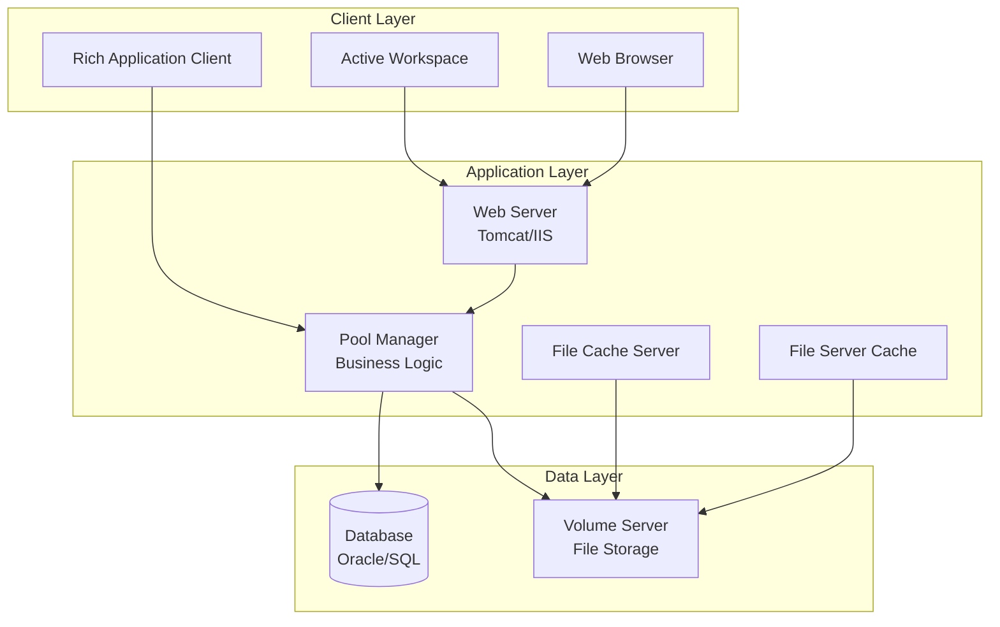

# Teamcenter 설치 가이드 및 요구사항

> **작성일**: 2025-11-26  
> **목적**: Teamcenter 설치 전 시스템 요구사항 및 설치 절차 이해

---

## 📋 목차

1. [공식 문서 다운로드 사이트](#공식-문서-다운로드-사이트)
2. [시스템 요구사항](#시스템-요구사항)
3. [설치 아키텍처](#설치-아키텍처)
4. [설치 전 준비사항](#설치-전-준비사항)
5. [설치 순서](#설치-순서)
6. [주요 구성요소 설치](#주요-구성요소-설치)
7. [설치 후 검증](#설치-후-검증)
8. [문제 해결](#문제-해결)

---

## 공식 문서 다운로드 사이트

### 1. Siemens Support Center (구 GTAC)

**메인 포털:**
- **URL**: https://support.sw.siemens.com/
- 구 GTAC (Global Technical Access Center)의 새 이름
- Teamcenter를 포함한 모든 Siemens Digital Industries Software 제품 지원

**제공 서비스:**
- ✅ 제품 다운로드 (설치 파일)
- ✅ 문서 (Installation Guide, User Manual, API Reference)
- ✅ Knowledge Base (FAQ, 문제 해결)
- ✅ Support Case 관리
- ✅ 교육 자료 및 커뮤니티

### 2. Teamcenter Documentation Portal

**URL**: https://docs.plm.automation.siemens.com/
- Teamcenter 2312 이후 개편된 문서 포털
- 카테고리별로 정리된 문서
- Installation Guide, Configuration Guide, Developer Guide 등

**주요 문서 카테고리:**
```
📁 Deployment & Installation
  ├─ Installation Guide
  ├─ System Requirements
  ├─ Configuration Guide
  └─ Upgrade & Migration Guide
  
📁 Administration
  ├─ System Administration
  ├─ User Management
  └─ Performance Tuning
  
📁 Development
  ├─ ITK Programmer's Guide
  ├─ ITK API Reference
  ├─ SOA Developer's Guide
  └─ BMIDE User Guide
  
📁 User Guides
  ├─ RAC User Guide
  ├─ Active Workspace Guide
  └─ Visualization Guide
```

### 3. 접근 방법

#### 계정 필요 (Webkey)
- Siemens PLM 소프트웨어 계약이 있어야 문서 및 다운로드 접근 가능
- **Webkey 계정**: Sold-to ID와 연결된 계정
- 회사의 Teamcenter 라이선스 담당자에게 문의

#### 계정 없는 경우
- 일부 공개 문서는 접근 가능
- 커뮤니티 포럼 일부 내용 열람 가능
- Trial 버전은 제한적

> **참고**: 교육 시 강사가 교육용 문서 및 설치 파일을 제공할 것입니다.

### 4. 커뮤니티 및 추가 리소스

**Siemens Community**
- URL: https://community.sw.siemens.com/
- 사용자 간 Q&A
- Best Practices 공유
- 예제 코드 및 팁

**파트너 사이트 (참고용)**
- PLM Coach: https://plmcoach.com/ (교육 자료)
- Sara Technologies: Teamcenter 컨설팅 관련 정보

---

## 시스템 요구사항

### 서버 하드웨어 요구사항

#### 프로덕션 환경 (권장)

| 구성요소 | 최소 사양 | 권장 사양 | 엔터프라이즈급 |
|---------|----------|----------|--------------|
| **CPU** | Intel Xeon 4 Core | Intel Xeon Gold 6250 4.5GHz+ | Intel Xeon Platinum 8+ Core |
| **RAM** | 16 GB | 64 GB | 128 GB+ |
| **Storage** | 500 GB | 1 TB (DB), 2 TB (Volume) | 5 TB+ (SSD/NVMe) |
| **Network** | 1 Gbps | 10 Gbps | 10 Gbps+ (Dedicated) |

#### 역할별 서버 사양

**Database Server (Oracle/SQL Server)**
- CPU: 8+ Core
- RAM: 64 GB+
- Storage: 1 TB+ (확장 가능, 사용량에 따라 증가)
- RAID 10 권장

**Business Logic / Web Server (Pool Manager, FCC, etc.)**
- CPU: 4+ Core
- RAM: 32-64 GB
- Storage: 500 GB

**Volume Server (파일 저장소)**
- CPU: 4 Core
- RAM: 16-32 GB
- Storage: 2 TB+ (사용자 증가에 따라 확장)

### 클라이언트 하드웨어 요구사항

#### RAC (Rich Application Client)
| 항목 | 최소 | 권장 |
|------|------|------|
| **CPU** | Intel i5 | Intel i7 이상 |
| **RAM** | 8 GB | 16 GB |
| **Storage** | 50 GB | 100 GB |
| **Graphics** | 통합 그래픽 | 전용 GPU (CAD 사용 시) |
| **Monitor** | 1920x1080 | 2560x1440+ (듀얼 모니터) |

#### Active Workspace (웹 브라우저)
- 최신 버전의 Chrome, Edge, Firefox
- RAM: 8 GB+
- 안정적인 네트워크 연결

---

## 소프트웨어 요구사항

### 서버 운영체제

#### Windows 기반
```
✅ Windows Server 2016
✅ Windows Server 2019
✅ Windows Server 2022 (최신 Teamcenter)
```

#### Linux 기반 (엔터프라이즈 환경)
```
✅ Red Hat Enterprise Linux (RHEL) 7.x, 8.x
✅ SUSE Linux Enterprise Server (SLES)
✅ Oracle Linux
```

### 데이터베이스

#### 지원 데이터베이스
```
✅ Oracle Database
   - Oracle 19c (권장)
   - Oracle 21c
   
✅ Microsoft SQL Server
   - SQL Server 2019
   - SQL Server 2022
   
✅ IBM DB2 (일부 환경)
```

**주의사항:**
- Express Edition은 지원하지 않음
- Enterprise 또는 Standard Edition 필요
- RAC (Real Application Clusters) 구성 가능

### 웹 애플리케이션 서버

```
✅ Apache Tomcat 9.x
✅ Red Hat JBoss EAP 7.x
✅ Microsoft IIS (Windows 환경)
```

### Java 환경

```
✅ Oracle JDK 11 (Teamcenter 공식 지원)
✅ Oracle JDK 17 (최신 버전)

❌ OpenJDK는 제한적 지원 (프로덕션 비권장)
```

### 클라이언트 운영체제

```
✅ Windows 10 (최신 빌드)
✅ Windows 11
⚠️ macOS (Active Workspace 웹만 지원, RAC 미지원)
⚠️ Linux Desktop (제한적 지원)
```

### CAD 통합 (옵션)

```
✅ Siemens NX (완벽 통합)
✅ CATIA V5/V6
✅ SolidWorks
✅ AutoCAD
✅ Creo (Pro/ENGINEER)
```

---

## 설치 아키텍처

### Teamcenter 구성요소



### 배포 시나리오

#### 1. Single-Server (개발/테스트 환경)
```
┌─────────────────────────────────┐
│  Single Server                  │
│  ├─ Database (SQL Server)       │
│  ├─ Pool Manager                │
│  ├─ Web Server (Tomcat)         │
│  ├─ Volume Server                │
│  └─ FCC/FSC                     │
└─────────────────────────────────┘

최소 요구사항:
- CPU: 8 Core
- RAM: 32 GB
- Storage: 500 GB
```

#### 2. Multi-Server (프로덕션 환경)
```
┌──────────────┐    ┌──────────────┐    ┌──────────────┐
│  Database    │    │  App Server  │    │  Web Server  │
│  Server      │◄───┤  (4-tier)    │◄───┤  Tomcat/IIS  │
│  Oracle/SQL  │    │  Pool Mgr    │    │  AWC         │
└──────────────┘    └──────────────┘    └──────────────┘
                            │
                            ▼
                    ┌──────────────┐
                    │  Volume      │
                    │  Server      │
                    └──────────────┘
```

#### 3. Enterprise HA (고가용성)
```
    ┌─────────────┐
    │ Load        │
    │ Balancer    │
    └──────┬──────┘
           │
     ┌─────┴─────┐
     │           │
┌────▼────┐ ┌───▼─────┐
│ Web 1   │ │ Web 2   │
└────┬────┘ └───┬─────┘
     │          │
     └─────┬────┘
           │
    ┌──────▼──────┐
    │ App Cluster │
    │ (Pool Mgr)  │
    └──────┬──────┘
           │
    ┌──────▼──────┐
    │ DB Cluster  │
    │ (Oracle RAC)│
    └─────────────┘
```

---

## 설치 전 준비사항

### 1. 라이선스 준비

```
필요한 정보:
✓ License Server 주소
✓ License File (*.lic)
✓ Webkey 계정
✓ Sold-to ID
```

### 2. 네트워크 구성

#### 방화벽 포트 오픈

| 서비스 | 포트 | 프로토콜 | 용도 |
|--------|------|---------|------|
| Pool Manager | 4544 | TCP | Business Logic |
| License Server | 28000 | TCP | FLEXlm |
| License Vendor Daemon | 28100 | TCP | FLEXlm |
| Web Server (HTTP) | 80, 8080 | TCP | Active Workspace |
| Web Server (HTTPS) | 443, 8443 | TCP | Secure Access |
| FCC | 4545 | TCP | File Cache |
| Volume Server | 4577 | TCP | File Transfer |
| Database (Oracle) | 1521 | TCP | Oracle TNS |
| Database (SQL Server) | 1433 | TCP | SQL Server |

#### DNS 설정
```
✓ 모든 서버의 FQDN (Fully Qualified Domain Name) 설정
✓ Reverse DNS 설정 (IP → 호스트명)
✓ Hosts 파일 또는 DNS Server 등록
```

### 3. 계정 준비

#### Windows 환경
```powershell
# Teamcenter 서비스 계정 (예: tcadmin)
- Domain Account 권장
- Local Administrator 권한
- 비밀번호 만료 없음 설정

# 데이터베이스 계정
- SQL Server: tcdb_admin
- Oracle: TCINFORMIX (기본 스키마)
```

#### Linux 환경
```bash
# Teamcenter 전용 사용자 생성
useradd -m -s /bin/bash tcadmin
passwd tcadmin

# 그룹 생성
groupadd tcgroup
usermod -aG tcgroup tcadmin
```

### 4. 필수 소프트웨어 설치 (사전 설치)

```
Windows:
✓ .NET Framework 4.8+
✓ Visual C++ Redistributable (최신)
✓ Java JDK 11 또는 17
✓ Database Client (Oracle Client / SQL Server Native Client)

Linux:
✓ Required Libraries (glibc, libstdc++, etc.)
✓ X Window System (GUI 설치 시)
✓ Oracle Instant Client / ODBC Driver
```

---

## 설치 순서

### Phase 1: 기반 인프라 구축

```
1. Database 설치
   └─ Oracle 19c / SQL Server 2019 설치
   └─ Database 생성 (TCINFORMIX 스키마)
   └─ Tablespace 구성

2. License Server 설치
   └─ FLEXlm License Manager 설치
   └─ License 파일 등록
   └─ 서비스 시작

3. 파일 서버 준비
   └─ Volume 디렉토리 생성
   └─ 공유 폴더 설정 (네트워크 스토리지)
```

### Phase 2: Teamcenter Server 설치

```
4. Teamcenter Enterprise Server 설치
   ├─ TEM (Teamcenter Environment Manager) 설치
   ├─ Database Configuration (DBConfig)
   │  └─ TCINFORMIX 스키마 초기화
   ├─ Pool Manager 구성
   ├─ Volume Server 구성
   └─ FCC/FSC 구성

5. Web Tier 설치
   ├─ Web Application Server (Tomcat) 설치
   ├─ Active Workspace 배포
   └─ Gateway 구성
```

### Phase 3: 클라이언트 설치

```
6. RAC (Rich Application Client) 배포
   └─ 클라이언트 설치 패키지 생성
   └─ 사용자 PC에 배포

7. Active Workspace 설정
   └─ 웹 브라우저 접속 테스트
```

### Phase 4: 초기 구성

```
8. Organization Model 구성
   ├─ Site 생성
   ├─ Group 생성
   └─ 사용자 생성 (infodba, tcadmin 등)

9. BMIDE 설치 (개발 환경)
   └─ Eclipse 기반 BMIDE 설치
   └─ 템플릿 프로젝트 생성
```

---

## 주요 구성요소 설치

### 1. Database 설정

#### Oracle 19c 설치 (예시)

```bash
# 1. Oracle 19c 설치 (GUI 또는 Silent)
./runInstaller

# 2. Database 생성
dbca

# 3. Tablespace 생성
sqlplus / as sysdba

CREATE TABLESPACE TCINFORMIX
DATAFILE '/u01/oradata/TC/tcinformix01.dbf' SIZE 10G
AUTOEXTEND ON NEXT 1G MAXSIZE UNLIMITED;

# 4. Teamcenter 사용자 생성
CREATE USER TCINFORMIX IDENTIFIED BY password
DEFAULT TABLESPACE TCINFORMIX
TEMPORARY TABLESPACE TEMP;

GRANT CONNECT, RESOURCE, DBA TO TCINFORMIX;
```

#### SQL Server 설정 (예시)

```sql
-- 1. Database 생성
CREATE DATABASE TCINFORMIX
ON PRIMARY
(
    NAME = 'TC_Data',
    FILENAME = 'D:\SQLData\TCINFORMIX.mdf',
    SIZE = 10GB,
    MAXSIZE = UNLIMITED,
    FILEGROWTH = 1GB
);

-- 2. 사용자 생성
CREATE LOGIN tcdb_admin WITH PASSWORD = 'password';
USE TCINFORMIX;
CREATE USER tcdb_admin FOR LOGIN tcdb_admin;

-- 3. 권한 부여
EXEC sp_addrolemember 'db_owner', 'tcdb_admin';
```

### 2. License Server 설치

```bash
# Windows
cd C:\Teamcenter\license_server
install_lmadmin.bat

# License 파일 복사
copy teamcenter.lic C:\Teamcenter\license_server\

# 서비스 시작
lmtools.exe
# → Start/Stop/Reread 탭에서 서비스 시작

# Linux
cd /opt/teamcenter/license_server
./install_lmadmin.sh

# License 파일 위치
cp teamcenter.lic /opt/teamcenter/license_server/

# 시작
./lmgrd -c teamcenter.lic -l /tmp/lmgrd.log
```

### 3. Teamcenter Enterprise 설치

#### TEM (Teamcenter Environment Manager) 사용

```
설치 미디어 실행:
1. setup.exe (Windows) 또는 ./install.sh (Linux)

2. 설치 타입 선택:
   ○ Enterprise (서버 구성요소)
   ○ Developer (개발 환경)
   ○ Client Only (클라이언트만)

3. 설치 경로:
   - Windows: C:\Siemens\Teamcenter13
   - Linux: /opt/siemens/teamcenter13

4. 컴포넌트 선택:
   ☑ Pool Manager
   ☑ Volume Server
   ☑ File Cache Server
   ☑ Web Tier
   ☑ BMIDE (개발 환경)
   ☐ RAC (별도 설치)

5. Database 연결 정보:
   - DB Type: Oracle / SQL Server
   - Server: dbserver.company.com
   - Port: 1521 / 1433
   - SID/Database: TCINFORMIX
   - Username: TCINFORMIX / tcdb_admin
   - Password: ********

6. License Server:
   - Host: license-server.company.com
   - Port: 28000

7. Volume 디렉토리:
   - Local: D:\TCData\volume
   - UNC: \\fileserver\tcvolume

8. Pool Manager 구성:
   - Pool Count: 4 (CPU 코어 수에 따라)
   - Memory per Pool: 2048 MB
```

### 4. DBConfig (Database Schema 초기화)

```bash
# Teamcenter Database Schema 초기화
cd %TC_ROOT%\install\dbconfig

# Windows
dbconfig.bat

# Linux
./dbconfig.sh

# 설정:
1. Database 연결 확인
2. Schema 버전 선택 (Teamcenter 버전에 맞춤)
3. 초기 데이터 로드
4. 인덱스 생성
5. 검증

# 완료 후 확인:
- TCINFORMIX 스키마에 200+ 테이블 생성됨
- POM_* 테이블들 (POM_APPLICATION_OBJECT, POM_USER 등)
```

### 5. Web Tier 설치

#### Tomcat + Active Workspace

```bash
# 1. Tomcat 설치 (Teamcenter 설치 시 포함)
cd %TC_ROOT%\install\webtier

# 2. Active Workspace 배포
deploy_awc.bat
# 또는
./deploy_awc.sh

# 3. Gateway 설정
# %TC_ROOT%\gateway\conf\gateway.properties
tc.server.host=poolmgr-server.company.com
tc.server.port=4544

# 4. Tomcat 시작
cd %TC_ROOT%\webtier\tomcat\bin
startup.bat  # Windows
./startup.sh  # Linux

# 5. 접속 테스트
URL: http://server:8080/awc
```

---

## 설치 후 검증

### 1. Database 연결 테스트

```bash
# Teamcenter 테스트 유틸리티
cd %TC_ROOT%\bin

# tcdbtest (Database 연결 테스트)
tcdbtest.exe

# 출력 예시:
Connected to TCINFORMIX@dbserver:1521
Database Version: 19.0.0.0.0
Schema Version: 13.3.0.0
Status: OK ✓
```

### 2. Pool Manager 시작 및 테스트

```bash
# Pool Manager 시작
cd %TC_ROOT%\bin

# Windows
tcserver_pool.bat start

# Linux
./tcserver_pool.sh start

# 로그 확인
tail -f %TC_DATA%\syslog\pool_manager_001.log

# 정상 메시지:
Pool Manager startup completed
Listening on port 4544
4 pools initialized
```

### 3. 클라이언트 접속 테스트

#### RAC 접속
```
1. RAC 실행
2. Server: poolmgr-server.company.com:4544
3. Username: infodba
4. Password: infodba (초기 비밀번호)
5. Group: dba

접속 성공 시:
- Home → My Teamcenter 화면 표시
```

#### Active Workspace 접속
```
1. 브라우저 열기
2. URL: http://webserver:8080/awc
3. Login:
   - Username: infodba
   - Password: infodba
   - Group: dba

접속 성공 시:
- Dashboard 표시
- Create, Search 기능 테스트
```

### 4. 기본 기능 테스트

```
테스트 항목:
☑ Item 생성 (Create → Item)
☑ Dataset 첨부 (파일 업로드)
☑ BOM 구조 생성
☑ Workflow 시작
☑ Query 실행 (Search)
☑ Import/Export
```

---

## 문제 해결

### 일반적인 설치 문제

#### 1. Pool Manager 시작 실패

**증상:**
```
Pool Manager failed to start
Error: Cannot connect to database
```

**해결:**
```bash
# 1. Database 연결 확인
tcdbtest

# 2. tnsnames.ora 확인 (Oracle)
# %ORACLE_HOME%\network\admin\tnsnames.ora

TCINFORMIX =
  (DESCRIPTION =
    (ADDRESS = (PROTOCOL = TCP)(HOST = dbserver)(PORT = 1521))
    (CONNECT_DATA = (SERVICE_NAME = TCINFORMIX))
  )

# 3. SQL Server ODBC 확인
# ODBC Data Source Administrator에서 연결 테스트

# 4. 환경 변수 확인
echo %TC_ROOT%
echo %TC_DATA%
echo %ORACLE_HOME%  # Oracle 사용 시
```

#### 2. Active Workspace 접속 안 됨

**증상:**
```
HTTP 502 Bad Gateway
또는
Connection refused
```

**해결:**
```bash
# 1. Tomcat 상태 확인
# Windows
tasklist | findstr java

# Linux
ps -ef | grep tomcat

# 2. Tomcat 로그 확인
# %TC_ROOT%\webtier\tomcat\logs\catalina.out

# 3. Gateway 설정 확인
# %TC_ROOT%\gateway\conf\gateway.properties

# 4. Pool Manager 연결 확인
telnet poolmgr-server 4544

# 5. Tomcat 재시작
cd %TC_ROOT%\webtier\tomcat\bin
shutdown.bat
startup.bat
```

#### 3. License 오류

**증상:**
```
License checkout failed
No license available
```

**해결:**
```bash
# 1. License Server 상태 확인
lmutil lmstat -a -c 28000@license-server

# 2. License 파일 reread
lmutil lmreread -c 28000@license-server

# 3. 방화벽 확인
telnet license-server 28000

# 4. Pool Manager 환경 변수
set SPLM_LICENSE_SERVER=28000@license-server
```

#### 4. Volume 파일 접근 오류

**증상:**
```
Cannot access volume
File upload failed
```

**해결:**
```bash
# 1. Volume 디렉토리 권한 확인
# Windows
icacls D:\TCData\volume

# Linux
ls -la /opt/tcdata/volume
chmod 755 /opt/tcdata/volume
chown tcadmin:tcgroup /opt/tcdata/volume

# 2. Pool Manager 설정 확인
# %TC_DATA%\preferences\FM_general.pref
FM_ROOT_DIR=D:/TCData/volume

# 3. 네트워크 공유 테스트 (UNC 사용 시)
net use \\fileserver\tcvolume /user:tcadmin password
```

### 로그 파일 위치

```
서버 로그:
%TC_DATA%\syslog\*
  ├─ pool_manager_001.log
  ├─ pool_manager_002.log
  ├─ volume_server.log
  └─ fcc_server.log

Tomcat 로그:
%TC_ROOT%\webtier\tomcat\logs\*
  ├─ catalina.out
  ├─ localhost.log
  └─ gateway.log

데이터베이스 로그:
# Oracle
$ORACLE_BASE/diag/rdbms/tcinformix/TCINFORMIX/trace/alert_TCINFORMIX.log

# SQL Server
C:\Program Files\Microsoft SQL Server\...\Log\ERRORLOG
```

---

## 체크리스트

### 설치 전 체크리스트

- [ ] 시스템 요구사항 확인 (CPU, RAM, Storage)
- [ ] 운영체제 버전 확인
- [ ] 데이터베이스 설치 및 구성
- [ ] License 파일 준비
- [ ] 방화벽 포트 오픈
- [ ] 서비스 계정 생성
- [ ] DNS/호스트 파일 설정
- [ ] Java JDK 설치
- [ ] 네트워크 스토리지 준비 (Volume)

### 설치 후 체크리스트

- [ ] Database 연결 테스트 (tcdbtest)
- [ ] Pool Manager 정상 시작
- [ ] License 체크아웃 확인
- [ ] RAC 접속 테스트
- [ ] Active Workspace 접속 테스트
- [ ] Item 생성 테스트
- [ ] 파일 업로드 테스트
- [ ] BOM 생성 테스트
- [ ] Query 실행 테스트
- [ ] 사용자 생성 및 권한 테스트

---

## 참고 자료

### 공식 문서

1. **Teamcenter Installation Guide**
   - 위치: Siemens Support Center → Documentation
   - 파일명: `TC_InstallationGuide_<version>.pdf`

2. **System Requirements**
   - 위치: https://support.sw.siemens.com/
   - 최신 지원 매트릭스 확인

3. **ITK Developer Guide**
   - 개발 환경 설정 포함

### 교육 자료

- Siemens 공식 교육 코스
- PLM Coach (https://plmcoach.com/)
- YouTube: "Teamcenter Installation Tutorial"

### 커뮤니티

- Siemens Community Forums
- Stack Overflow (teamcenter 태그)
- LinkedIn Teamcenter User Groups

---

## 요약

### 핵심 포인트

1. **공식 문서는 Siemens Support Center에서 다운로드** (Webkey 계정 필요)
2. **시스템 요구사항**: 서버 64GB RAM, 1TB Storage 권장
3. **필수 구성요소**: Database → License → Teamcenter Server → Web Tier
4. **설치 순서 엄수**: 기반부터 단계적 설치
5. **검증 필수**: 각 단계마다 테스트

### 교육 준비 팁

- 교육 시 제공되는 설치 이미지 사용 (Virtual Machine)
- Database는 이미 구성되어 있을 가능성 높음
- 개발 환경 (BMIDE)에 집중
- 설치보다는 **개발 실습**에 중점

---

> **다음 학습**: BMIDE 환경 설정, ITK 개발 환경 구축, 첫 번째 ITK 프로그램 작성

**교육 중 설치 관련 질문이 생기면 이 가이드를 참고하세요! 📚**
